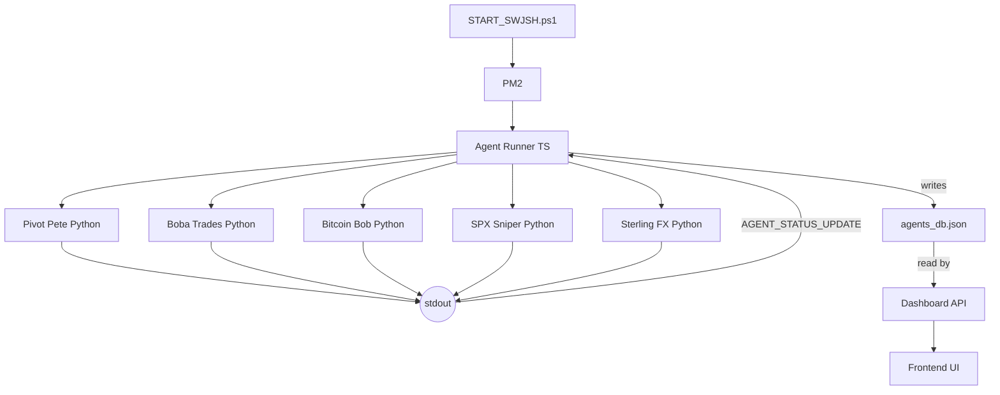

# Agent Runner

---
tags: #architecture #agents #orchestration
status: 📘 Reference
---

## Overview

The **Agent Runner** is the master orchestrator that manages all trading agents as child processes. It's the single entry point for starting the autonomous trading system.

**File**: `scripts/agent_runner.ts`

---

## Responsibilities

1. **Spawn Python agents** as child processes
2. **Monitor agent health** (CPU, memory, crash detection)
3. **Parse status updates** from agent stdout
4. **Update shared state** (`agents_db.json`)
5. **Handle agent restarts** on crash (30s delay)
6. **Provide unified logging**

---

## Architecture



---

## Implementation

### Core Structure

```typescript
// scripts/agent_runner.ts

import { spawn, ChildProcess } from 'child_process';
import fs from 'fs';
import path from 'path';

interface AgentConfig {
  id: string;
  name: string;
  script: string;
  market: string;
  enabled: boolean;
}

const AGENTS: AgentConfig[] = [
  {
    id: 'pivot-pete',
    name: 'Pivot Pete',
    script: 'scripts/pivot_pete_engine.py',
    market: 'Futures',
    enabled: true
  },
  {
    id: 'boba-trades',
    name: 'Boba Trades',
    script: 'scripts/boba_trades_engine.py',
    market: 'Options',
    enabled: true
  },
  {
    id: 'bitcoin-bob',
    name: 'Bitcoin Bob',
    script: 'scripts/bitcoin_bob_engine.py',
    market: 'Crypto',
    enabled: true
  },
  {
    id: 'spx-sniper',
    name: 'SPX Sniper',
    script: 'scripts/spx_sniper_engine.py',
    market: 'Options',
    enabled: true
  },
  {
    id: 'sterling-fx',
    name: 'Sterling FX',
    script: 'scripts/sterling_fx_engine.py',
    market: 'Forex',
    enabled: true
  }
];

const AGENTS_DB_PATH = 'src/app/api/agents/agents_db.json';
const RESTART_DELAY_MS = 30000;  // 30 seconds

class AgentRunner {
  private processes: Map<string, ChildProcess> = new Map();
  private agentsDb: Record<string, any> = {};

  async start() {
    console.log('[AgentRunner] Starting...');

    // Load existing state
    this.loadAgentsDb();

    // Spawn enabled agents
    for (const agent of AGENTS) {
      if (agent.enabled) {
        this.spawnAgent(agent);
      }
    }

    console.log(`[AgentRunner] Spawned ${this.processes.size} agents`);
  }

  spawnAgent(config: AgentConfig) {
    console.log(`[AgentRunner] Spawning ${config.name}...`);

    const process = spawn('python', [config.script], {
      cwd: path.resolve(__dirname, '..'),
      env: { ...process.env }
    });

    this.processes.set(config.id, process);

    // Handle stdout
    process.stdout.on('data', (data: Buffer) => {
      const output = data.toString();
      this.handleAgentOutput(config.id, output);
    });

    // Handle stderr
    process.stderr.on('data', (data: Buffer) => {
      console.error(`[${config.id}] ERROR: ${data.toString()}`);
    });

    // Handle crash
    process.on('exit', (code) => {
      console.log(`[${config.id}] Exited with code ${code}`);
      this.processes.delete(config.id);

      // Auto-restart after delay
      setTimeout(() => {
        console.log(`[AgentRunner] Restarting ${config.name}...`);
        this.spawnAgent(config);
      }, RESTART_DELAY_MS);
    });

    // Update initial state
    this.updateAgentState(config.id, {
      id: config.id,
      name: config.name,
      market: config.market,
      status: 'starting'
    });
  }

  handleAgentOutput(agentId: string, output: string) {
    // Check for status update line
    const lines = output.split('\n');
    for (const line of lines) {
      if (line.startsWith('AGENT_STATUS_UPDATE:')) {
        const jsonStr = line.substring('AGENT_STATUS_UPDATE:'.length);
        try {
          const status = JSON.parse(jsonStr);
          this.updateAgentState(agentId, status);
        } catch (e) {
          console.error(`[${agentId}] Failed to parse status: ${e}`);
        }
      } else if (line.trim()) {
        // Regular log output
        console.log(`[${agentId}] ${line}`);
      }
    }
  }

  updateAgentState(agentId: string, state: any) {
    this.agentsDb[agentId] = {
      ...this.agentsDb[agentId],
      ...state,
      last_update: new Date().toISOString()
    };
    this.saveAgentsDb();
  }

  loadAgentsDb() {
    try {
      const data = fs.readFileSync(AGENTS_DB_PATH, 'utf-8');
      this.agentsDb = JSON.parse(data);
    } catch (e) {
      console.log('[AgentRunner] Creating new agents_db.json');
      this.agentsDb = {};
    }
  }

  saveAgentsDb() {
    fs.writeFileSync(
      AGENTS_DB_PATH,
      JSON.stringify(this.agentsDb, null, 2)
    );
  }
}

// Main entry point
const runner = new AgentRunner();
runner.start();
```

---

## Agent Communication Protocol

### Python Agent Output

Agents communicate by printing JSON to stdout:

```python
import json
import sys

def emit_status(status: dict):
    """Send status to Agent Runner"""
    print(f"AGENT_STATUS_UPDATE:{json.dumps(status)}")
    sys.stdout.flush()  # Critical! Ensure immediate delivery

# Example usage
emit_status({
    'agent_id': 'pivot-pete',
    'status': 'active',
    'current_position': {
        'symbol': 'ES',
        'side': 'long',
        'entry': 5850.25
    },
    'daily_pnl': 250.00
})
```

### Status Fields

| Field | Type | Description |
|-------|------|-------------|
| `agent_id` | string | Agent identifier |
| `status` | string | 'starting', 'active', 'idle', 'paused', 'error' |
| `current_position` | object | Current open position (null if none) |
| `daily_pnl` | number | Today's P&L |
| `total_pnl` | number | All-time P&L |
| `open_trades` | number | Count of open positions |
| `closed_trades` | number | Today's closed trades |
| `last_signal` | string | ISO timestamp of last signal |

---

## Shared State File

**File**: `src/app/api/agents/agents_db.json`

```json
{
  "pivot-pete": {
    "id": "pivot-pete",
    "name": "Pivot Pete",
    "market": "Futures",
    "status": "active",
    "current_position": {
      "symbol": "ES",
      "side": "long",
      "entry_price": 5850.25,
      "size": 1
    },
    "daily_pnl": 250.00,
    "total_pnl": 1250.00,
    "win_rate": 0.65,
    "last_update": "2026-03-15T14:30:00Z"
  },
  "boba-trades": {
    "id": "boba-trades",
    "name": "Boba Trades",
    "status": "idle",
    ...
  }
}
```

---

## Crash Recovery

### Auto-Restart Behavior

1. Agent process exits (crash or error)
2. Agent Runner detects exit
3. Waits 30 seconds (configurable)
4. Spawns new process
5. Updates state to 'starting'

### Restart Limits

```typescript
const MAX_RESTARTS = 10;
const RESTART_WINDOW_MS = 60 * 60 * 1000; // 1 hour

// If agent crashes more than 10 times in 1 hour,
// stop auto-restart and alert
```

---

## Adding a New Agent

### 1. Create Python Engine

```python
# scripts/my_new_agent_engine.py

import time
import json

class MyNewAgent:
    def __init__(self):
        self.running = True

    def run(self):
        while self.running:
            # Your trading logic here
            status = {
                'agent_id': 'my-new-agent',
                'status': 'active',
                'daily_pnl': 0.00
            }
            print(f"AGENT_STATUS_UPDATE:{json.dumps(status)}")

            time.sleep(60)  # Run loop every minute

if __name__ == '__main__':
    agent = MyNewAgent()
    agent.run()
```

### 2. Register in Agent Runner

```typescript
// scripts/agent_runner.ts

const AGENTS: AgentConfig[] = [
  // ... existing agents ...
  {
    id: 'my-new-agent',
    name: 'My New Agent',
    script: 'scripts/my_new_agent_engine.py',
    market: 'Stocks',
    enabled: true
  }
];
```

### 3. Add to agents_db.json

```json
{
  "my-new-agent": {
    "id": "my-new-agent",
    "name": "My New Agent",
    "status": "idle",
    "market": "Stocks"
  }
}
```

---

## Monitoring

### Logs

```bash
# PM2 logs for Agent Runner
pm2 logs agent-runner

# Watch specific agent output
pm2 logs agent-runner | grep "pivot-pete"
```

### Health Check

```bash
# Check if Agent Runner is alive
pm2 list | grep agent-runner

# Check agents_db.json freshness
stat src/app/api/agents/agents_db.json
```

---

## Troubleshooting

### Agent Not Starting

**Symptoms**: Agent missing from PM2 list

**Check**:
1. Python available: `python --version`
2. Script exists: `ls scripts/pivot_pete_engine.py`
3. Dependencies installed: `pip install -r requirements.txt`
4. Check Agent Runner logs: `pm2 logs agent-runner`

### Agent Crash Loop

**Symptoms**: Agent keeps restarting every 30s

**Fix**:
1. Check agent logs for error: `pm2 logs agent-runner | grep ERROR`
2. Fix the underlying Python error
3. Restart Agent Runner: `pm2 restart agent-runner`

### Status Not Updating

**Symptoms**: Dashboard shows stale agent data

**Check**:
1. Agent emitting status: Look for `AGENT_STATUS_UPDATE` in logs
2. `sys.stdout.flush()` called after print
3. agents_db.json writable: `touch src/app/api/agents/agents_db.json`

---

## Configuration

### Enable/Disable Agents

Edit `scripts/agent_runner.ts`:

```typescript
{
  id: 'pivot-pete',
  enabled: false  // Disable this agent
}
```

### Change Restart Delay

```typescript
const RESTART_DELAY_MS = 60000;  // 1 minute instead of 30s
```

---

## Related Pages

- [[Agent System]] - Overall agent architecture
- [[Pivot Pete]] - Example agent implementation
- [[Startup Commands]] - Starting Agent Runner
- [[Troubleshooting]] - Common issues
- [[API Reference]] - `/api/agents` endpoint
