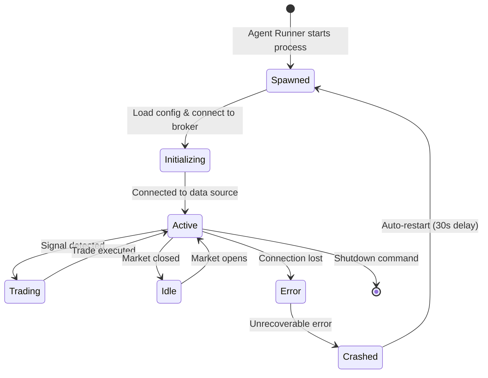

# Agent System

---
tags: #architecture #agents
status: 📘 Reference
---

## What Are Trading Agents?

Trading agents are **autonomous Python processes** that:
1. Monitor live market data
2. Execute trading strategies
3. Manage positions and risk
4. Report status to the dashboard
5. Learn from performance (via TheProfessor & TheAuditor)

**Philosophy**: Each agent specializes in a specific market with its own personality and approach.

---

## Active Agents

| Agent | Market | Status | Broker | Strategy |
|-------|--------|--------|--------|----------|
| [[Pivot Pete]] | Futures (ES, NQ, YM) | 🔧 In Dev | OANDA | ORB |
| [[Boba Trades]] | Options | ⚠️ Needs Review | Alpaca | Premium selling |
| [[Bitcoin Bob]] | Crypto (BTC, ETH) | ⚠️ Needs Review | Alpaca | Trend following |
| [[SPX Sniper]] | SPX Options | ⚠️ Needs Review | Alpaca | 0DTE strategies |
| [[Sterling FX]] | Forex | ⚠️ Needs Review | OANDA | Trend + mean reversion |

---

## Architecture

### Agent Runner (Orchestrator)
**File**: `scripts/agent_runner.ts`

**Responsibilities**:
- Spawns all Python agents as child processes
- Monitors agent health (CPU, memory, crash detection)
- Auto-restarts agents after 30 seconds if they crash
- Parses agent status updates from stdout
- Updates shared state file (`agents_db.json`)

**Critical Rule**: ⚠️ **Never run Python agents directly** - always use Agent Runner to avoid duplicate instances

---

### Communication Protocol

Agents communicate with the dashboard via **stdout JSON**:

```python
# In Python agent code
import json

status = {
    'agent_id': 'pivot-pete',
    'status': 'active',  # 'active' | 'idle' | 'error'
    'current_position': {
        'symbol': 'ES',
        'side': 'long',
        'entry_price': 5850.25,
        'size': 1,
        'unrealized_pnl': 125.00
    },
    'daily_pnl': 250.00,
    'open_trades': 1,
    'closed_trades': 3,
    'last_signal': '2026-03-15T14:30:00Z'
}

print(f"AGENT_STATUS_UPDATE:{json.dumps(status)}")
```

Agent Runner parses lines starting with `AGENT_STATUS_UPDATE:` and updates `agents_db.json`.

---

### Shared State

**File**: `src/app/api/agents/agents_db.json`

**Structure**:
```json
{
  "pivot-pete": {
    "id": "pivot-pete",
    "name": "Pivot Pete",
    "status": "active",
    "market": "Futures",
    "current_position": {...},
    "daily_pnl": 250.00,
    "total_pnl": 1250.00,
    "win_rate": 0.65,
    "reviews": [...],  // TheProfessor's trade grades
    "audits": [...]    // TheAuditor's fact-checks
  },
  "boba-trades": {...},
  ...
}
```

Frontend polls `/api/agents` which reads this file.

---

## Agent Lifecycle



---

## Agent Components

### 1. Market Data Provider
Fetches real-time price data and historical bars.

**Providers**:
- Alpaca (stocks, crypto, options)
- OANDA (forex, futures)
- Polygon (alternative)
- yfinance (fallback)

**Example** (`src/lib/engine/local_runner/MarketData.ts`):
```typescript
class MarketData {
  async getLatestBars(symbols: string[]): Promise<Bar[]> {
    // Fetch from Alpaca or OANDA
  }

  subscribeRealTime(symbols: string[], callback: (bar: Bar) => void) {
    // WebSocket subscription
  }
}
```

---

### 2. Strategy Engine
Evaluates market conditions and generates signals.

**Base Class** (`src/lib/engine/types.ts`):
```typescript
interface BaseStrategy {
  name: string;
  category: 'OPTIONS' | 'CRYPTO' | 'FOREX' | 'FUTURES';
  onCandle(bar: Bar): Signal | null;
  onTick(tick: Tick): Signal | null;
}
```

See: [[Strategies Overview]]

---

### 3. Trade Executor
Submits orders to brokers and manages positions.

**File**: `src/lib/tradeExecutor.ts`

**Functions**:
- Submit market/limit orders
- Calculate position size based on risk
- Set stop-loss and take-profit
- Track open positions

---

### 4. TheProfessor (Trade Review)
**File**: `src/lib/engine/local_runner/TheProfessor.ts`

Grades closed trades on a scale of A-F based on:
- Entry timing (was it at support/resistance?)
- Exit execution (did we maximize profit?)
- Risk management (was stop-loss appropriate?)

**Output**: Stored in `agents_db.json` under `reviews` array

---

### 5. TheAuditor (Fact-Checker)
**File**: `src/lib/engine/local_runner/TheAuditor.ts`

Validates TheProfessor's grading with independent analysis:
- Checks if market conditions matched evaluation
- Verifies data accuracy
- Flags inconsistencies

**Output**: Stored in `agents_db.json` under `audits` array

---

## Risk Management

### Position Sizing
**File**: `src/lib/engine/risk.ts`

```typescript
function calculatePositionSize(
  accountBalance: number,
  riskPerTrade: number,  // Percentage (e.g., 1 = 1%)
  entryPrice: number,
  stopLoss: number
): number {
  const riskAmount = accountBalance * (riskPerTrade / 100);
  const riskPerShare = Math.abs(entryPrice - stopLoss);
  return Math.floor(riskAmount / riskPerShare);
}
```

### Kill Switch
**File**: `src/lib/engine/risk/KillSwitch.ts`

Emergency halt triggered by:
- Daily loss threshold exceeded (e.g., -3%)
- Consecutive losing trades (e.g., 5 in a row)
- Manual activation via [[LLM Control API]]

**Status**: Stored in database `settings` table
**Effect**: Blocks all new trades until reset

---

## Agent Development Guide

### Creating a New Agent

1. **Create Python file**: `scripts/new_agent_engine.py`

2. **Implement core loop**:
```python
import time
import json
from data_provider import AlpacaDataProvider
from strategy import MyStrategy

class NewAgentEngine:
    def __init__(self):
        self.data = AlpacaDataProvider()
        self.strategy = MyStrategy()

    def emit_status(self, data):
        print(f"AGENT_STATUS_UPDATE:{json.dumps(data)}")

    def run(self):
        while True:
            bars = self.data.get_latest_bars(['SPY'])
            signal = self.strategy.evaluate(bars)

            if signal:
                # Execute trade
                pass

            self.emit_status({
                'agent_id': 'new-agent',
                'status': 'active',
                'daily_pnl': 0.00
            })

            time.sleep(60)  # 1-minute loop

if __name__ == '__main__':
    agent = NewAgentEngine()
    agent.run()
```

3. **Register in Agent Runner** (`scripts/agent_runner.ts`):
```typescript
const agents = [
  { id: 'pivot-pete', script: 'scripts/pivot_pete_engine.py' },
  { id: 'new-agent', script: 'scripts/new_agent_engine.py' },  // Add here
];
```

4. **Add to dashboard** (`src/app/api/agents/agents_db.json`):
```json
{
  "new-agent": {
    "id": "new-agent",
    "name": "New Agent",
    "status": "idle",
    "market": "Stocks",
    "description": "My new trading agent"
  }
}
```

---

## Troubleshooting

### Agent Not Starting
**Symptoms**: Missing from dashboard, no status updates

**Causes**:
1. Agent Runner not started (`./START_SWJSH.ps1`)
2. Python dependencies missing (run `pip install -r requirements.txt`)
3. Environment variables not set
4. Agent crashed immediately (check logs: `pm2 logs`)

**Fix**:
```powershell
pm2 logs agent-runner
pm2 restart agent-runner
```

---

### Duplicate Agent Instances
**Symptoms**: Multiple positions opened, double trades

**Cause**: Running Python agent directly instead of via Agent Runner

**Fix**:
```powershell
# Kill all Python processes
taskkill /F /IM python.exe

# Restart properly
./START_SWJSH.ps1
```

---

### Status Not Updating
**Symptoms**: Dashboard shows stale data

**Causes**:
1. Agent not emitting status updates
2. `agents_db.json` file permissions
3. Agent Runner not parsing stdout

**Fix**:
```powershell
# Check agents_db.json is writable
cat src/app/api/agents/agents_db.json

# Verify Agent Runner is running
pm2 list

# Check agent stdout
pm2 logs pivot-pete --lines 50
```

---

## Performance Monitoring

### Metrics Tracked
- **Daily P&L**: Net profit/loss for current session
- **Total P&L**: Cumulative all-time performance
- **Win Rate**: Percentage of profitable trades
- **Open Trades**: Current active positions
- **Closed Trades**: Completed trades today
- **Last Signal**: Timestamp of most recent trade signal

### Dashboard Views
- `/agents` - Grid of all agents with status cards
- `/agents/[id]` - Individual agent terminal with chat
- `/dashboard` - Market overview with agent panel

---

## Autonomous Improvement Agents

In addition to trading agents, the system runs **6 improvement agents** that autonomously evaluate, fix, and ticket improvements via Jira. These are managed as a 7th process by Agent Runner.

See [[Management Agents]] and [[Jira Agent System]] for full details.

---

## Related Pages

- [[Pivot Pete]] - Futures agent details
- [[Boba Trades]] - Options agent
- [[Bitcoin Bob]] - Crypto agent
- [[SPX Sniper]] - 0DTE options
- [[Sterling FX]] - Forex agent
- [[Agent Runner]] - Orchestration system
- [[Management Agents]] - 6 autonomous improvement agents
- [[Jira Agent System]] - Jira integration & self-learning
- [[Strategies Overview]] - Trading logic
- [[Risk Management]] - Position sizing & kill switch
