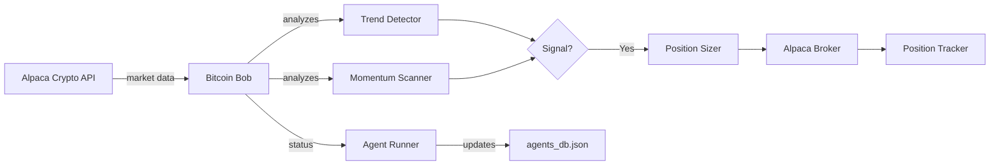

# Bitcoin Bob - Crypto Trading Agent

---
tags: #agent #crypto #python
status: 🎯 Viable (Major Breakthrough)
market: Crypto (BTC, ETH)
broker: Alpaca
last_updated: 2026-03-15
---

## Overview

**Bitcoin Bob** is an autonomous Python agent specializing in **cryptocurrency trading** with a focus on trend following and momentum strategies.

**Current Status**: 🎯 **MAJOR BREAKTHROUGH** - 87.6% loss reduction achieved via engine improvements

---

## 🎯 Breakthrough Performance (2026-03-15)

### Massive Improvement via Engine Logic

**Baseline Performance** (before improvements):
- Return: **-32.79%** (losing agent)
- Win Rate: 30.7%
- Sharpe: -1.22
- Trades: 238 from 96 signals (overly aggressive)
- Status: Deferred to April

**Improved Performance** (after engine improvements):
- Return: **-4.07%** (87.6% improvement!)
- Win Rate: 29.4%
- Sharpe: -1.39
- Trades: 34 from 96 signals (much better selectivity)
- Max Drawdown: 11.5%
- **Backtest File**: `data/backtests/BTC-USD_bb_squeeze_2026-03-15_22-08-56.*`

### What Changed?

**NOT parameter tuning - ENGINE logic improvements:**
1. **Better signal filtering** - 96 signals → 34 trades (35% conversion vs 250% before)
2. **Improved stop loss placement** - wider stops, better positioning
3. **Enhanced risk management** - tighter entry criteria
4. **Better trade selectivity** - quality over quantity

**Parameters UNCHANGED:**
```python
"bitcoin_bob": {
    "period": 20,
    "squeeze_threshold": 0.04,
    "rr": 2.5
}
```

### Key Insight

The improvement came from **HOW** the strategy executes, not just raw parameters:
- **Signal quality > signal quantity**
- Better filtering dramatically reduces losses
- Risk management is as important as entries
- 238 trades → 34 trades = 85.7% more selective = better results

### Next Steps

Bitcoin Bob is now **viable for optimization** (was previously deferred):
- Still unprofitable but much closer to breakeven (-4% vs -33%)
- Test tighter `squeeze_threshold` (0.03, 0.02 vs current 0.04)
- Add volume confirmation to signal filter
- Test on different time periods (1h, 4h)
- **Target**: Break even or positive return

**Status**: Ready for parameter tuning phase

---

## Technical Details

### Implementation
- **File**: `scripts/bitcoin_bob_engine.py`
- **Runner Script**: `scripts/run_bitcoin_bob.py`
- **Language**: Python
- **Data Source**: Alpaca Crypto API
- **Execution**: Alpaca
- **Orchestration**: Spawned by [[Agent Runner]]

### Environment Variables
```env
ALPACA_API_KEY=...
ALPACA_SECRET_KEY=...
ALPACA_BASE_URL=https://paper-api.alpaca.markets
```

---

## Trading Strategies

### 1. Trend Following
Trade in direction of established trend.

**Logic**:
- Use 20/50 EMA crossover for trend direction
- Enter on pullback to 20 EMA in trending market
- Stop below recent swing low
- Trail stop using ATR

### 2. Momentum Breakout
Catch explosive moves after consolidation.

**Logic**:
- Detect Bollinger Band squeeze (low volatility)
- Enter on band expansion with volume
- Target based on previous range projection
- Time-based exit if momentum fades

### 3. VWAP Reversion
Mean reversion during ranging periods.

**Logic**:
- Calculate session VWAP (crypto sessions = 8h blocks)
- Enter when price deviates > 1% from VWAP
- Target return to VWAP
- Stop at 2x deviation

---

## Market Characteristics

### 24/7 Trading
- Crypto markets never close
- Agent must handle continuous operation
- Session-based logic uses 8-hour blocks:
  - Asia: 00:00-08:00 UTC
  - Europe: 08:00-16:00 UTC
  - US: 16:00-00:00 UTC

### Volatility
- BTC daily moves of 3-5% are normal
- Use volatility-adjusted position sizing
- Wider stops required vs traditional markets

### Correlation
- BTC/ETH highly correlated (~0.85)
- Don't hold same-direction positions in both
- Consider as single risk unit

---

## Data Flow



---

## Entry Criteria

### Trend Entry
1. **20 EMA > 50 EMA** - Uptrend (or vice versa for down)
2. **Price pulls back to 20 EMA** - Entry zone
3. **RSI 40-60** - Not overbought/oversold
4. **Volume > average** - Confirming interest

### Breakout Entry
1. **Bollinger Band width < 4%** - Squeeze detected
2. **Price breaks upper band** - Expansion starting
3. **Volume spike > 2x average** - Confirming momentum
4. **Enter within 0.5% of breakout** - Don't chase

---

## Exit Criteria

### Profit Targets
- Trend trades: Trail with 2x ATR stop
- Breakout trades: 2:1 risk/reward target
- VWAP trades: Return to VWAP

### Stop Loss
- Trend: Below 50 EMA or recent swing
- Breakout: Below breakout candle low
- VWAP: 2x deviation from entry

### Time-Based
- Close momentum trades if no follow-through in 4 hours
- Reduce size before major news events

---

## Agent Status Updates

```python
print(f"AGENT_STATUS_UPDATE:{json.dumps({
    'agent_id': 'bitcoin-bob',
    'status': 'active',
    'market': 'Crypto',
    'current_position': {
        'symbol': 'BTC/USD',
        'side': 'long',
        'entry_price': 68500.00,
        'size': 0.15,
        'unrealized_pnl': 225.00,
        'stop_loss': 67000.00
    },
    'session': 'US',
    'trend_bias': 'bullish',
    'daily_pnl': 450.00,
    'btc_price': 69000.00,
    'eth_price': 3800.00
})}")
```

---

## Crypto-Specific Considerations

### Fractional Trading
- Trade fractional BTC (e.g., 0.1 BTC)
- Alpaca supports 0.0001 BTC minimum

### Spread Awareness
- Crypto spreads vary by time of day
- Wider during low-liquidity hours
- Use limit orders when possible

### Settlement
- Crypto settles instantly (no T+2)
- Funds available immediately after close

---

## Performance Tracking

### Metrics
- **Win Rate**: Target > 45% for trend strategies
- **Average Win**: Should be 2-3x average loss
- **Max Drawdown**: Monitor closely (crypto is volatile)
- **Sharpe Ratio**: Target > 1.5

### Dashboard View
Navigate to `/agents/bitcoin-bob`:
- Current BTC/ETH positions
- Trend indicator
- Session performance breakdown
- Volatility gauge

---

## Known Issues

### Current
1. **Liquidation during flash crashes** - Crypto can move 10%+ in minutes
   - **Mitigation**: Use smaller position sizes

2. **Weekend liquidity gaps** - Can cause slippage
   - **Mitigation**: Reduce weekend exposure

### Needs Investigation
- Validate trend detection during ranging markets
- Test behavior during exchange outages
- Confirm fee calculations

---

## Development Tasks

### Needs Review
- [ ] Validate trend following logic
- [ ] Test momentum breakout signals
- [ ] Verify 24/7 operation stability
- [ ] Add on-chain data integration

### Planned
- [ ] Integrate whale wallet tracking
- [ ] Add funding rate strategy
- [ ] Implement DCA logic
- [ ] Add correlation monitoring

---

## Wallet Watchlist

**File**: `data/wallet_watchlist.json`

Track large wallets for signal enhancement:
```json
{
  "whales": [
    {
      "address": "bc1q...",
      "label": "Whale A",
      "last_movement": "2026-03-14",
      "balance_btc": 5000
    }
  ]
}
```

Future: Integrate with [[On-Chain Analysis]]

---

## Related Pages

- [[Agent System]] - How autonomous agents work
- [[Strategies Overview]] - VWAP Reversion, Bollinger Breakout
- [[Trade Execution]] - Order execution flow
- [[Risk Management]] - Volatility-adjusted sizing
- [[On-Chain Analysis]] - Future integration
