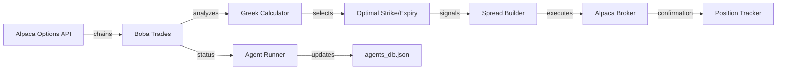

# Boba Trades - Options Trading Agent

---
tags: #agent #options #python
status: 🔧 Optimization Pending
market: Options (SPY, QQQ, individual stocks)
broker: Alpaca
---

## Overview

**Boba Trades** is an autonomous Python agent specializing in **options trading** with a focus on premium selling strategies.

**Current Status**: Backtest analysis complete, parameter optimization pending

---

## 🔧 Optimization Analysis (2026-03-15)

### Baseline Performance
| Metric | Value | Target | Status |
|--------|-------|--------|--------|
| Win Rate | 39.1% | >40% | ⚠️ Close |
| Return | +0.73% | >5% | ❌ Low |
| Sharpe | 0.06 | >0.5 | ❌ Poor |
| Trades | 69 | - | OK |
| Avg Duration | 13 hrs | <4 hrs | ⚠️ Long |

### Problems Identified

1. **min_touches: 2 too low**
   - Wins averaged 20-44 zone touches
   - Losses averaged 2-7 zone touches
   - Low-quality zones generating false signals

2. **zone_tolerance: 0.3% too wide**
   - $2 zone width on SPY = fuzzy entries
   - Not respecting true S/R levels

3. **Stop loss too tight**
   - 11 of 11 recent losses were stop-outs
   - Formula: `risk * 0.5` cuts too close

4. **R:R 2.0 unrealistic**
   - 13-hour avg duration = theta decay
   - Targets rarely hit

### Recommended Parameter Changes

```python
# Current → Recommended
"min_touches": 2 → 3         # Higher quality zones
"zone_tolerance_pct": 0.3 → 0.15  # Tighter zones ($1 not $2)
"rr": 2.0 → 1.5              # Achievable targets

# Stop loss formula (code change needed):
# OLD: sl = zone_price - risk * 0.5
# NEW: sl = zone_price - risk * 1.0
```

### Expected Outcome
- Win Rate: 39% → 45-48%
- Return: 0.73% → 3-5%
- Sharpe: 0.06 → 0.3-0.5

### Critical Finding
**Strategy Mismatch**: Live engine uses impulse-based zones (15m), backtest uses touch-counting (5m). Need to align before paper trading.

### Next Steps
1. Apply parameter changes to `backtest_config.py`
2. Re-run backtest
3. If passes (>40% WR, >3% return), deploy to paper

---

## Technical Details

### Implementation
- **File**: `scripts/boba_trades_engine.py`
- **Options Engine**: `scripts/boba_options_engine.py`
- **Language**: Python
- **Data Source**: Alpaca Options API
- **Execution**: Alpaca
- **Orchestration**: Spawned by [[Agent Runner]]

### Environment Variables
```env
ALPACA_API_KEY=...
ALPACA_SECRET_KEY=...
ALPACA_BASE_URL=https://paper-api.alpaca.markets
```

---

## Trading Strategies

### 1. Credit Spreads
Sell premium with defined risk.

**Bull Put Spread**:
- Sell OTM put
- Buy further OTM put (protection)
- Profit if price stays above short strike

**Bear Call Spread**:
- Sell OTM call
- Buy further OTM call (protection)
- Profit if price stays below short strike

### 2. Iron Condors
Neutral strategy for range-bound markets.

- Sell OTM put spread + sell OTM call spread
- Profit zone between short strikes
- Max loss is spread width minus premium received

### 3. Covered Calls
Income generation on long stock positions.

- Own 100 shares
- Sell OTM call against position
- Keep premium + potential stock appreciation to strike

---

## Greek-Based Sizing

Position size based on portfolio Greeks:

```python
class GreekCalculator:
    def calculate_position_delta(self, option, quantity):
        """Net delta exposure from position"""
        return option.delta * quantity * 100  # 100 shares per contract

    def portfolio_theta(self, positions):
        """Daily time decay (positive = earning premium)"""
        return sum(p.theta * p.quantity * 100 for p in positions)

    def max_position_by_delta(self, max_delta, option):
        """How many contracts to stay within delta limit"""
        return int(max_delta / (abs(option.delta) * 100))
```

---

## Data Flow



---

## Entry Criteria

### Credit Spread Entry
1. **IV Rank > 30** - Selling premium when IV is elevated
2. **Delta < 0.30** - Short strikes OTM for higher probability
3. **Days to Expiry: 30-45** - Optimal theta decay
4. **Credit > 1/3 Width** - Risk/reward threshold

### Iron Condor Entry
1. **IV Rank > 40** - Need elevated premium
2. **Price within range** - Not trending strongly
3. **Short strikes at 0.16 delta** - ~84% probability
4. **Balance both sides** - Equal delta exposure

---

## Exit Criteria

### Profit Targets
- Credit spreads: Close at 50% max profit
- Iron condors: Close at 50% max profit
- Covered calls: Let expire if OTM, roll if ITM

### Loss Management
- Close at 200% of credit received (1:2 risk)
- Roll to next expiration if possible
- Close entire position if tested hard

### Time-Based
- Close all positions by 21 DTE
- Avoid gamma risk near expiration

---

## Agent Status Updates

```python
print(f"AGENT_STATUS_UPDATE:{json.dumps({
    'agent_id': 'boba-trades',
    'status': 'active',
    'market': 'Options',
    'current_positions': [
        {
            'symbol': 'SPY',
            'strategy': 'iron_condor',
            'expiry': '2026-04-17',
            'short_put': 580,
            'short_call': 610,
            'delta': -5.2,
            'theta': 12.50,
            'unrealized_pnl': 45.00
        }
    ],
    'portfolio_delta': -15.5,
    'portfolio_theta': 45.00,
    'daily_pnl': 125.00
})}")
```

---

## Options Utilities

**File**: `scripts/options_utils.py`

### Key Functions

```python
def get_option_chain(symbol: str, expiry: str) -> pd.DataFrame:
    """Fetch full options chain for symbol/expiry"""
    pass

def find_optimal_spread(
    chain: pd.DataFrame,
    strategy: str,  # 'put_credit', 'call_credit', 'iron_condor'
    target_delta: float,
    width: int
) -> dict:
    """Find best spread based on criteria"""
    pass

def calculate_pop(option: dict) -> float:
    """Probability of profit calculation"""
    pass

def calculate_expected_value(spread: dict) -> float:
    """EV = (POP * max_profit) - ((1-POP) * max_loss)"""
    pass
```

---

## Performance Tracking

### Metrics
- **Win Rate**: Target > 70% for high-probability strategies
- **Average Win**: ~$50-100 per spread
- **Average Loss**: ~$100-200 per spread
- **Portfolio Theta**: Daily time decay earned
- **Delta Exposure**: Net directional risk

### Dashboard View
Navigate to `/agents/boba-trades`:
- Current positions with Greeks
- Portfolio-level Greeks
- P&L breakdown by strategy
- Win/loss streak

---

## Known Issues

### Current
1. **Options data lag** - Alpaca options quotes may be delayed
   - **Workaround**: Use wider bid-ask filters

2. **Multi-leg execution** - Legs may fill separately
   - **Workaround**: Use limit orders on spread

### Needs Investigation
- Validate paper trading results match expected P&L
- Confirm Greek calculations against broker values
- Test roll functionality

---

## Development Tasks

### Needs Review
- [ ] Validate credit spread entry logic
- [ ] Test iron condor execution
- [ ] Verify Greek calculations
- [ ] Add position management (rolling)

### Planned
- [ ] Add diagonal spread strategy
- [ ] Implement earnings play detection
- [ ] Add IV percentile calculation
- [ ] Backtesting integration

---

## Related Pages

- [[Agent System]] - How autonomous agents work
- [[SPX Sniper]] - Related options agent (0DTE)
- [[Trade Execution]] - Order execution flow
- [[Risk Management]] - Greek-based risk limits
- [[Alpaca Data]] - Data provider details
