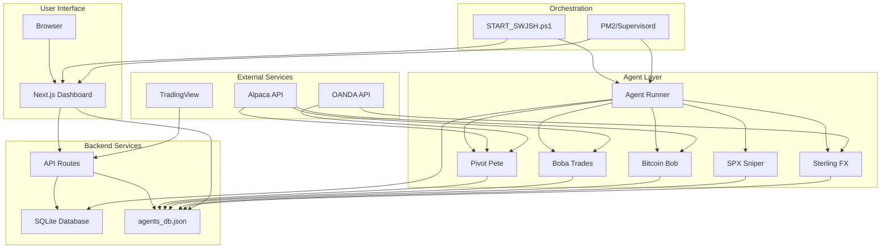

# Connection Map

---
tags: #architecture #reference #dependencies
status: 📘 Reference
---

## What Depends on What?

Visual reference for understanding component dependencies and data flow in SwjshAK.

---

## System-Level Dependencies



---

## Startup Dependencies

**Execution Order**:

1. **Environment Variables** (.env file)
   ↓
2. **START_SWJSH.ps1** (or Docker Compose)
   ↓
3. **PM2/Supervisord** (process manager)
   ↓
4. **Agent Runner** (TypeScript orchestrator)
   ├→ Spawns: Pivot Pete (Python)
   ├→ Spawns: Boba Trades (Python)
   ├→ Spawns: Bitcoin Bob (Python)
   ├→ Spawns: SPX Sniper (Python)
   └→ Spawns: Sterling FX (Python)
   ↓
5. **Next.js Dashboard** (frontend)
   ↓
6. **User Browser** (localhost:3000)

**Critical Path**: If Agent Runner fails, no agents start.

---

## Data Flow Dependencies

### Signal Processing

```
TradingView Alert
  ↓ [webhook]
POST /api/webhook/tradingview
  ↓ [validation]
SQLite 'signals' table
  ↓ [polling by agent]
Agent Strategy Evaluation
  ↓ [signal generated]
Trade Executor
  ↓ [broker API call]
OANDA/Alpaca Broker
  ↓ [order filled]
SQLite 'trades' table
  ↓ [status update]
agents_db.json
  ↓ [API polling]
Dashboard Frontend
  ↓ [render]
User sees trade
```

**Dependencies**:
- TradingView → Requires WEBHOOK_SECRET env var
- Agent → Requires broker API keys (ALPACA_*, OANDA_*)
- Dashboard → Requires agents_db.json to exist

---

## File Dependencies

### Frontend Depends On:

| File | Depends On | Why |
|------|------------|-----|
| `src/app/dashboard/page.tsx` | `/api/agents`, `/api/journal` | Fetches agent status and trades |
| `src/app/agents/page.tsx` | `agents_db.json` via `/api/agents` | Real-time agent monitoring |
| `src/components/Dashboard/TradingChart.tsx` | `lightweight-charts` library | Chart rendering |
| `src/app/globals.css` | HSL color variables | Theming system |

---

### Backend Depends On:

| File | Depends On | Why |
|------|------------|-----|
| `src/app/api/agents/route.ts` | `agents_db.json` | Reads agent state |
| `src/app/api/journal/route.ts` | `src/lib/db.ts` | Database queries |
| `src/app/api/webhook/tradingview/route.ts` | `WEBHOOK_SECRET` env var | Authentication |
| `src/lib/db.ts` | `better-sqlite3` package | Database driver |

---

### Agent Runner Depends On:

| File | Depends On | Why |
|------|------------|-----|
| `scripts/agent_runner.ts` | Python installed | Spawns Python subprocesses |
| `scripts/agent_runner.ts` | `*_engine.py` files | Agent implementations |
| `scripts/agent_runner.ts` | `agents_db.json` (writable) | Updates agent state |

---

### Python Agents Depend On:

| Agent | Data Source | Broker | Python Packages |
|-------|-------------|--------|----------------|
| Pivot Pete | Alpaca | OANDA | `yfinance`, `pandas`, `requests` |
| Boba Trades | Alpaca | Alpaca | `yfinance`, `pandas`, `requests` |
| Bitcoin Bob | Alpaca | Alpaca | `yfinance`, `pandas`, `requests` |
| SPX Sniper | Alpaca | Alpaca | `yfinance`, `pandas`, `requests` |
| Sterling FX | OANDA | OANDA | `yfinance`, `pandas`, `requests` |

**Package Installation**: Each agent has `requirements_*.txt` or uses shared `requirements.txt`

---

## Environment Variable Dependencies

### Required for Startup

```env
# Core
WEBHOOK_SECRET=xxx           # TradingView webhooks
ACCOUNT_BALANCE=10000        # Risk calculations
RISK_PER_TRADE=1             # Position sizing

# Alpaca (for Boba, Bob, SPX Sniper + Pivot Pete data)
ALPACA_API_KEY=xxx
ALPACA_SECRET_KEY=xxx
ALPACA_BASE_URL=https://paper-api.alpaca.markets

# OANDA (for Pivot Pete execution + Sterling FX)
OANDA_API_KEY=xxx
OANDA_ACCOUNT_ID=xxx
OANDA_BASE_URL=https://api-fxpractice.oanda.com
```

---

### Optional (Feature-Specific)

```env
# Database (if using Prisma - not currently active)
DATABASE_URL=file:./swjsh.db

# Authentication (if using multi-user features)
FIREBASE_API_KEY=xxx
FIREBASE_AUTH_DOMAIN=xxx
FIREBASE_PROJECT_ID=xxx

# Notifications (future)
DISCORD_WEBHOOK_URL=xxx
TELEGRAM_BOT_TOKEN=xxx
```

---

## External Service Dependencies

### TradingView
**Used By**: Signal ingestion
**Endpoint**: `POST /api/webhook/tradingview`
**Failure Impact**: Manual signals still work, but automated alerts won't arrive

---

### Alpaca API
**Used By**: Pivot Pete (data), Boba, Bob, SPX Sniper (data + execution)
**Endpoints**:
- `https://paper-api.alpaca.markets/v2/bars` (historical data)
- `https://paper-api.alpaca.markets/v2/orders` (trade execution)
**Failure Impact**: Agents can't fetch data or execute trades

---

### OANDA API
**Used By**: Pivot Pete (execution), Sterling FX (data + execution)
**Endpoints**:
- `https://api-fxpractice.oanda.com/v3/accounts/{accountId}/pricing` (data)
- `https://api-fxpractice.oanda.com/v3/accounts/{accountId}/orders` (execution)
**Failure Impact**: Forex/futures agents can't trade

---

## Breaking Points (What Breaks What)

### If agents_db.json is corrupted/missing:
❌ Dashboard shows no agents
❌ Agent status updates fail
❌ Can't pause/resume agents via UI
✅ Agents still run and execute trades (they just don't report status)

**Fix**: Restore from backup or recreate with default structure

---

### If SQLite database is corrupted:
❌ Trade history lost
❌ Journal entries gone
❌ Can't fetch historical performance
✅ Agents still run (they don't depend on database for execution)

**Fix**: Restore from backup or reinitialize with `initDB()`

---

### If Agent Runner crashes:
❌ All agents stop (Python processes terminated)
❌ No status updates
❌ No new trades executed
✅ Dashboard still accessible (just shows stale data)

**Fix**: Restart with `pm2 restart agent-runner`

---

### If Next.js Dashboard crashes:
❌ Can't view UI
❌ Can't access API routes (webhooks, signals, control)
✅ Agents still run independently
✅ Can use [[LLM Control API]] if it's standalone

**Fix**: Restart with `pm2 restart dashboard` or `npm start`

---

### If broker API is down (Alpaca/OANDA):
❌ Can't fetch real-time data
❌ Can't execute trades
✅ Agents stay alive (retry logic)
✅ Dashboard still works

**Fix**: Wait for broker to recover, or switch to fallback data source

---

## Circular Dependencies (None!)

SwjshAK architecture is **acyclic** - no circular dependencies exist.

**Verification**:
- Agents → agents_db.json (write only)
- Dashboard → agents_db.json (read only)
- Agent Runner → Agents (one-way spawn)
- API Routes → Database (read/write, but database doesn't call back)

---

## Related Pages

- [[System Architecture]] - Overall system design
- [[Agent System]] - Agent orchestration details
- [[Database Schema]] - Data persistence
- [[Troubleshooting]] - What to do when things break
- [[Startup Commands]] - How to start the system
