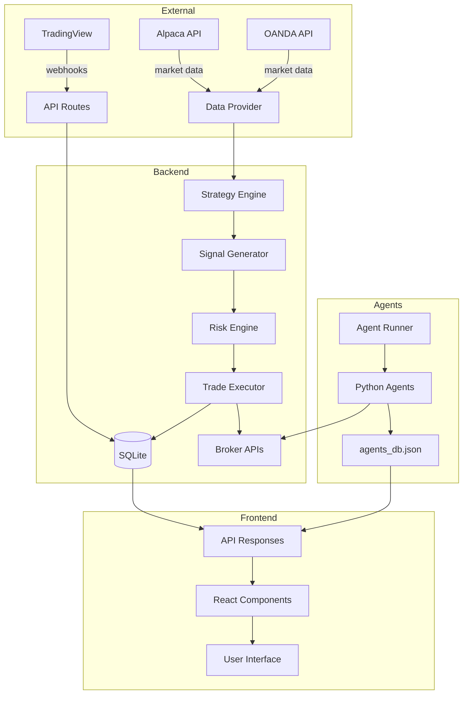

# Data Flow

---
tags: #architecture #data #core
status: 📘 Reference
---

## Overview

This document traces how data moves through the SwjshAK system, from external sources to user interface.

---

## High-Level Data Flow



---

## Flow 1: Market Data Ingestion

### From Alpaca

```
Alpaca WebSocket → Data Provider → Bar Objects → Strategy Engine
```

**Details**:
1. WebSocket connection established on startup
2. Subscribe to symbols (ES, SPY, BTC, etc.)
3. Real-time bars pushed every minute
4. Data Provider normalizes to standard format
5. Strategy Engine evaluates each bar

**Code Path**:
```
src/lib/data-providers/alpaca.ts
  → MarketData.ts
    → StrategyLoop.ts
```

### From OANDA

```
OANDA REST API → Polling (1m) → Candle Objects → Strategy Engine
```

**Details**:
1. Poll `/v3/accounts/{id}/candles` every minute
2. Parse response into standard bar format
3. Feed to forex/futures strategies

---

## Flow 2: Signal Generation

```
Market Bar → Strategy.onCandle() → Signal Object → Risk Validation → Database
```

**Step by Step**:

1. **Bar arrives** from data provider
```typescript
const bar = { open: 5850, high: 5855, low: 5840, close: 5852, volume: 1000 };
```

2. **Strategy evaluates**
```typescript
const signal = orbStrategy.onCandle(bar);
// Returns: { symbol: 'ES', action: 'buy', price: 5852, ... }
```

3. **Risk validation**
```typescript
const approved = await riskEngine.validate(signal);
// Checks: kill switch, position limits, daily loss
```

4. **Signal recorded**
```typescript
await db.insert('signals', signal);
```

---

## Flow 3: Trade Execution

```
Validated Signal → Trade Executor → Broker API → Order Confirmation → Trade Record
```

**Details**:

1. **Build order**
```typescript
const order = {
  symbol: signal.symbol,
  qty: calculateSize(signal),
  side: signal.action,
  type: 'market'
};
```

2. **Submit to broker**
```typescript
// Alpaca
const result = await alpaca.createOrder(order);

// OANDA
const result = await oanda.submitOrder(order);
```

3. **Handle response**
```typescript
if (result.filled) {
  await db.insert('trades', {
    symbol: signal.symbol,
    entry_price: result.filled_avg_price,
    quantity: result.filled_qty,
    entry_time: new Date().toISOString()
  });
}
```

---

## Flow 4: TradingView Webhook

```
TradingView Alert → POST /api/webhook → Validation → Signal Table → Processing
```

**Request**:
```http
POST /api/webhook/tradingview
X-Webhook-Secret: your_secret
Content-Type: application/json

{
  "symbol": "ES",
  "action": "buy",
  "price": 5850,
  "strategy": "ORB"
}
```

**Handler** (`src/app/api/webhook/tradingview/route.ts`):
```typescript
export async function POST(request: Request) {
  // 1. Validate secret
  // 2. Parse JSON
  // 3. Record to signals table
  // 4. Trigger processing
  return Response.json({ success: true });
}
```

---

## Flow 5: Agent Status Updates

```
Python Agent → stdout → Agent Runner → agents_db.json → API → Dashboard
```

**Python Output**:
```python
print(f"AGENT_STATUS_UPDATE:{json.dumps(status)}")
sys.stdout.flush()
```

**Agent Runner Parse**:
```typescript
process.stdout.on('data', (data) => {
  const line = data.toString();
  if (line.startsWith('AGENT_STATUS_UPDATE:')) {
    const status = JSON.parse(line.slice(20));
    updateAgentsDb(status);
  }
});
```

**API Response** (`GET /api/agents`):
```typescript
const agents = JSON.parse(fs.readFileSync('agents_db.json'));
return Response.json({ agents });
```

**Dashboard**:
```typescript
const { data: agents } = useSWR('/api/agents', fetcher, { refreshInterval: 5000 });
```

---

## Flow 6: Dashboard → User

```
API Response → React State → Component Render → DOM Update → User Sees
```

**Polling**:
```typescript
// Dashboard polls every 5 seconds
useEffect(() => {
  const interval = setInterval(fetchAgents, 5000);
  return () => clearInterval(interval);
}, []);
```

**State Update**:
```typescript
const [agents, setAgents] = useState([]);

async function fetchAgents() {
  const response = await fetch('/api/agents');
  const data = await response.json();
  setAgents(data.agents);
}
```

**Render**:
```tsx
{agents.map(agent => (
  <AgentCard key={agent.id} agent={agent} />
))}
```

---

## Data Stores

### SQLite Database

**Location**: `swjsh.db`

**Tables**:
| Table | Purpose | Write From | Read By |
|-------|---------|------------|---------|
| `trades` | Trade records | Trade Executor | Dashboard, Journal |
| `signals` | Signal history | Webhooks, Strategies | Signal Processing |
| `journal_entries` | User notes | Journal Page | Journal Page |
| `settings` | Configuration | Settings Page | All components |

### agents_db.json

**Location**: `src/app/api/agents/agents_db.json`

**Purpose**: Real-time agent state

**Structure**:
```json
{
  "agent-id": {
    "id": "agent-id",
    "status": "active",
    "current_position": {...},
    "daily_pnl": 250.00,
    "last_update": "2026-03-15T14:30:00Z"
  }
}
```

**Write**: Agent Runner
**Read**: `/api/agents` endpoint, Dashboard

---

## Data Formats

### Bar/Candle

```typescript
interface Bar {
  timestamp: string;  // ISO 8601
  open: number;
  high: number;
  low: number;
  close: number;
  volume: number;
  symbol?: string;
}
```

### Signal

```typescript
interface Signal {
  symbol: string;
  action: 'buy' | 'sell' | 'close';
  price: number;
  stopLoss?: number;
  takeProfit?: number;
  reason: string;
  strategy: string;
  timestamp: string;
}
```

### Trade

```typescript
interface Trade {
  id: number;
  symbol: string;
  side: 'long' | 'short';
  entry_price: number;
  exit_price?: number;
  quantity: number;
  entry_time: string;
  exit_time?: string;
  pnl?: number;
  strategy: string;
  agent_id?: string;
}
```

### Agent Status

```typescript
interface AgentStatus {
  agent_id: string;
  name: string;
  status: 'active' | 'idle' | 'paused' | 'error';
  market: string;
  current_position?: Position;
  daily_pnl: number;
  total_pnl: number;
  open_trades: number;
  closed_trades: number;
  last_signal?: string;
  last_update: string;
}
```

---

## Timing Considerations

### Latency Points

| Path | Expected Latency |
|------|-----------------|
| Alpaca data → Strategy | < 100ms |
| Signal → Broker | 200-500ms |
| Agent status → Dashboard | 5s (polling) |
| TradingView → API | 1-5s (network) |

### Bottlenecks

1. **SQLite writes** - Can block on concurrent access
2. **Broker API** - Rate limited, network dependent
3. **Dashboard polling** - 5s refresh interval
4. **Agent stdout** - Buffered, may delay

---

## Error Handling

### Data Provider Failure

```typescript
try {
  const bars = await alpaca.getBars(symbol);
} catch (error) {
  console.error('Alpaca data failed, using fallback');
  const bars = await yfinance.getBars(symbol);
}
```

### Database Failure

```typescript
try {
  await db.insert('trades', trade);
} catch (error) {
  // Log to file as backup
  fs.appendFileSync('failed_trades.log', JSON.stringify(trade));
  throw error;
}
```

### Agent Communication Failure

```typescript
// Agent Runner handles crashed agents
process.on('exit', (code) => {
  console.log(`Agent ${id} exited with code ${code}`);
  // Auto-restart after delay
  setTimeout(() => spawnAgent(config), 30000);
});
```

---

## Related Pages

- [[System Architecture]] - Overall architecture
- [[Signal Processing]] - Signal flow details
- [[Trade Execution]] - Execution flow
- [[Agent Runner]] - Agent communication
- [[Database Schema]] - Data storage
- [[API Reference]] - Endpoint details
