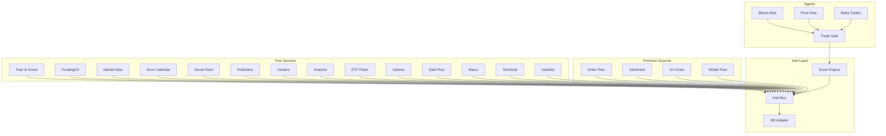

# Intel Layer

---
tags: #architecture #intel #trading
status: 🆕 Active Development
last_updated: 2026-03-17
---

## Overview

The Intel Layer aggregates market intelligence from **18 data sources** to gate trades and adjust position sizes. It provides a unified scoring system that helps agents decide whether to take a trade and how much to risk.

**Location**: `src/lib/intel/`

---

## Architecture



---

## Intel Sources (18 Total)

### Premium Sources (4)

| Source | Key | Data Provider | Signals |
|--------|-----|---------------|---------|
| **Order Flow** | `ORDER_FLOW` | Bookmap, Jigsaw | CVD, delta, absorption |
| **Sentiment** | `SENTIMENT` | News APIs | Headline sentiment scores |
| **On-Chain** | `ONCHAIN_CONFLUENCE` | Glassnode, Nansen | Blockchain analytics |
| **Whale Flow** | `WHALE_FLOW` | Whale Alert | Large wallet movements |

### Free Sources (14)

| Source | Key | Data Provider | Signals |
|--------|-----|---------------|---------|
| **Fear & Greed** | `FEAR_GREED` | Alternative.me | Crypto Fear & Greed Index |
| **Funding/OI** | `FUNDING_OI` | Binance | Funding rates, open interest |
| **Market Data** | `MARKET_DATA` | CoinGecko | Prices, volume, market cap |
| **Econ Calendar** | `ECON_CALENDAR` | ForexFactory | FOMC, NFP, CPI events |
| **Social Feed** | `SOCIAL_FEED` | Twitter/X | Trending topics, mentions |
| **Politician Trades** | `POLITICIAN_TRADES` | Capitol Trades, Quiver | Congressional STOCK Act filings |
| **Insider Flow** | `INSIDER_FLOW` | SEC EDGAR | Form 4 insider transactions |
| **Analyst Ratings** | `ANALYST_RATINGS` | Various | Wall Street upgrades/downgrades |
| **ETF Flows** | `ETF_FLOWS` | ETF providers | BTC/ETH ETF inflows/outflows |
| **Options Unusual** | `OPTIONS_UNUSUAL` | Options data | Unusual activity, sweeps |
| **Dark Pool** | `DARK_POOL` | FINRA | Dark pool prints, blocks |
| **Macro Sentiment** | `MACRO_SENTIMENT` | AAII, surveys | Investor sentiment, PMI |
| **Technical Levels** | `TECHNICAL_LEVELS` | Calculated | Key S/R, pivots, MAs |
| **Volatility** | `VOLATILITY` | CBOE | VIX, volatility regime |

---

## How It Works

### 1. Signal Collection

Each intel source emits signals to the Intel Bus:

```typescript
// Example: Politician trade signal
intelBus.emit({
    source: 'POLITICIAN_TRADES',
    symbol: 'NVDA',
    bias: 'BULLISH',  // or BEARISH, NEUTRAL
    strength: 0.8,    // 0-1 scale
    context: 'Nancy Pelosi bought $1M NVDA calls',
    expires_at: Date.now() + 86400000  // 24h TTL
});
```

### 2. Score Calculation

When an agent wants to trade, it asks for an intel score:

```typescript
const score = await intelBus.score('BTCUSD', 'LONG');

// score = {
//   overall: 0.65,        // -1.0 to +1.0
//   sizeMultiplier: 1.2,  // Position size adjustment
//   sources: [...],       // Contributing signals
//   vetoed: false         // Hard block if true
// }
```

### 3. Trade Gating

The score determines if the trade proceeds:

| Score Range | Action | Size Multiplier |
|-------------|--------|-----------------|
| > 0.7 | Strong GO | 1.5x |
| 0.3 to 0.7 | Normal GO | 1.0x |
| -0.3 to 0.3 | Proceed with caution | 0.75x |
| < -0.3 | VETO - Don't trade | 0x |

---

## Key Files

| File | Purpose |
|------|---------|
| `intel/types.ts` | Type definitions, weights, TTLs |
| `intel/bus.ts` | Central message bus, dedup, routing |
| `intel/adapter.ts` | Database persistence |
| `intel/regime.ts` | Market regime detection |
| `intel/free/service.ts` | Free API aggregation |
| `intel/politicians/service.ts` | Congressional trades |
| `intel/insiders/service.ts` | SEC Form 4 parsing |
| `intel/options/service.ts` | Unusual options |
| `intel/darkpool/service.ts` | Dark pool prints |
| `intel/__tests__/` | Integration tests |

---

## Configuration

### Weights

Each source has a configurable weight (env var override):

```typescript
const INTEL_WEIGHTS = {
    ORDER_FLOW: 0.20,        // Highest weight - direct market data
    SENTIMENT: 0.12,
    WHALE_FLOW: 0.10,
    FEAR_GREED: 0.08,
    POLITICIAN_TRADES: 0.06,
    // ... etc
};

// Override via env:
// INTEL_WEIGHT_ORDER_FLOW=0.25
```

### TTLs

Signals expire after their TTL:

| Source Type | Default TTL |
|-------------|-------------|
| Order Flow | 5 minutes |
| Sentiment | 30 minutes |
| Politician Trades | 24 hours |
| Analyst Ratings | 7 days |
| Technical Levels | 1 hour |

### Free-Only Mode

If `FREE_SOURCES_ONLY=true`, weights redistribute to free sources:

```typescript
// Premium sources get 0 weight
// Free sources get proportionally higher weights
```

---

## Adding a New Source

1. Create service in `src/lib/intel/{source}/service.ts`
2. Add type to `IntelSource` enum in `types.ts`
3. Add to `SOURCE_REGISTRY` with metadata
4. Add default weight to `INTEL_WEIGHTS`
5. Add TTL to `INTEL_TTL_MS`
6. Write tests in `__tests__/`
7. Update this brain page!

---

## Related Pages

- [[System Architecture]] - Overall system design
- [[Risk Management]] - Position sizing integration
- [[Agent System]] - How agents use intel
- [[Bitcoin Bob]] - Primary intel consumer

---

## Status

- **Phase**: Active Development
- **Premium Sources**: Configured but not connected
- **Free Sources**: 14 pillars implemented (March 2026)
- **Tests**: `flow-integration.test.ts`, `pillars.test.ts`
- **Next**: Wire agents to Intel Bus for live gating
