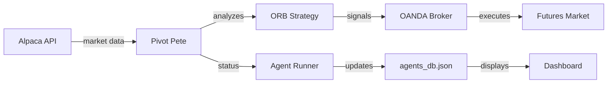

# Pivot Pete - Futures Trading Agent

---
tags: #agent #futures #python
status: ❌ Deferred to April
market: Futures (ES, NQ, YM)
broker: OANDA
last_validated: 2026-03-15
---

## Overview

**Pivot Pete** is an autonomous Python agent specializing in **futures trading** across major indices:
- **ES** (E-mini S&P 500)
- **NQ** (E-mini Nasdaq-100)
- **YM** (E-mini Dow)

**Current Status**: ❌ **DEFERRED TO APRIL** - Backtest validation showed significant losses

---

## ⚠️ Backtest Results (2026-03-15)

**Performance Metrics**:
- Return: **-28.63%** (significant losses)
- Win Rate: **27.7%** (below acceptable threshold)
- Status: **NOT READY** for paper trading

**Decision**: Defer to April for comprehensive strategy review and re-engineering.

**Issues to Address**:
- Opening range detection accuracy
- Breakout signal quality
- Stop loss placement
- Position sizing
- Risk management

**Timeline**: Re-evaluate in April after addressing fundamental strategy issues

---

## Technical Details

### Implementation
- **File**: `scripts/pivot_pete_engine.py`
- **Language**: Python
- **Data Source**: Alpaca API (recently migrated from OANDA)
- **Execution**: OANDA broker
- **Orchestration**: Spawned by [[Agent Runner]]

### Environment Variables
```env
# Data Provider (Alpaca)
ALPACA_API_KEY=...
ALPACA_SECRET_KEY=...
ALPACA_BASE_URL=https://paper-api.alpaca.markets

# Broker (OANDA)
OANDA_API_KEY=...
OANDA_ACCOUNT_ID=...
OANDA_BASE_URL=https://api-fxpractice.oanda.com
```

---

## Trading Strategy

### Primary: Opening Range Breakout (ORB)
- Monitors first 15 minutes of futures session
- Identifies high/low range
- Enters on breakout with volume confirmation
- Stop-loss below/above range

### Risk Management
- Position sizing based on account balance
- Risk per trade: 1% of capital
- Dynamic stop-loss adjustment
- Session-based trade limits

---

## Recent Changes

### 2026-03-15
- ✅ Fixed startup issues with env loading (commit a334d20)
- ✅ Migrated to Alpaca for market data
- ✅ Consolidated environment variables
- 🔧 In Progress: Backtest harness integration

### 2026-03-10
- Added real-data provider integration
- Created start/stop scripts for manual control
- Fixed cron job conflicts

---

## Data Flow



---

## Agent Status Updates

Pivot Pete emits JSON status to stdout, parsed by [[Agent Runner]]:

```python
print(f"AGENT_STATUS_UPDATE:{json.dumps({
    'agent_id': 'pivot-pete',
    'status': 'active',
    'market': 'ES',
    'current_position': {
        'symbol': 'ES',
        'side': 'long',
        'entry': 5850.25,
        'size': 1
    },
    'daily_pnl': 250.00,
    'open_trades': 1,
    'closed_trades': 3
})}")
```

---

## Performance Tracking

### Backtest Results (2026-03-15)
| Metric | Value |
|--------|-------|
| Win Rate | 27.7% |
| Return | -28.63% |
| Sharpe Ratio | -2.2 |
| Status | ❌ LOSING |

**Decision**: Deferred to April for further optimization. See [[🎯 Master Tracker]] for details.

**Note**: Agent requires significant parameter tuning before deployment.

---

## Known Issues

### Current
1. **Environment variable duplication** - Some OANDA vars redundant
   - **Fix**: Cleanup in progress

2. **Backtest data gaps** - Need complete historical futures data
   - **Fix**: Using Alpaca historical API

### Resolved
- ✅ Startup failures due to missing env vars (fixed a334d20)
- ✅ Duplicate agent instances when run manually (documented in startup guide)

---

## Development Tasks

### In Progress
- [ ] Universal backtest harness integration
- [ ] Historical performance validation
- [ ] Parameter optimization (ORB timeframe, breakout threshold)

### Planned
- [ ] Multi-contract support (pyramiding)
- [ ] Session-specific strategies (overnight vs RTH)
- [ ] Correlation with VIX for risk adjustment

---

## Code Reference

### Main Engine
```python
# scripts/pivot_pete_engine.py

class PivotPeteEngine:
    def __init__(self):
        self.alpaca = AlpacaDataProvider()
        self.oanda_broker = OANDABroker()
        self.orb_strategy = ORBStrategy()

    def run(self):
        """Main event loop"""
        while True:
            bars = self.alpaca.get_latest_bars(['ES', 'NQ', 'YM'])
            signals = self.orb_strategy.evaluate(bars)

            for signal in signals:
                self.oanda_broker.execute(signal)

            self.emit_status_update()
            time.sleep(60)  # 1-minute loop
```

### ORB Strategy
Located in: `src/lib/engine/strategies/orb.ts` (TypeScript reference)

See also: [[ORB Strategy]] for detailed logic

---

## Related Pages

- [[Agent System]] - How autonomous agents work
- [[ORB Strategy]] - Opening Range Breakout details
- [[Agent Runner]] - Process orchestration
- [[OANDA Broker]] - Execution layer
- [[Alpaca Data]] - Market data provider
- [[Universal Backtest]] - Testing framework

---

## Monitoring

### Dashboard View
Navigate to: `/agents/pivot-pete` in the frontend

**Real-time Metrics**:
- Current position
- Daily P&L
- Open/closed trade count
- Last signal timestamp
- Agent health status

### Logs
```powershell
# View Pivot Pete logs
pm2 logs pivot-pete

# Or in agents_db.json
cat src/app/api/agents/agents_db.json | jq '.["pivot-pete"]'
```

---

## Startup Commands

**Do NOT run directly** - use Agent Runner:

```powershell
# CORRECT
./START_SWJSH.ps1

# WRONG (creates duplicate instance)
python scripts/pivot_pete_engine.py
```

For manual control during development:
```powershell
# Start/stop scripts (use with caution)
python scripts/run_pivot_pete.py --start
python scripts/run_pivot_pete.py --stop
```
