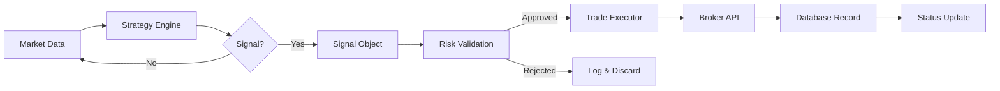

# Signal Processing

---
tags: #signals #architecture #core
status: 📘 Reference
---

## Overview

**Signal processing** is the flow from raw market data to actionable trade decisions.

**Flow**: Market Data → Strategy Evaluation → Signal Generation → Validation → Execution

---

## Signal Lifecycle



---

## Signal Sources

### 1. TradingView Webhooks

External alerts from TradingView indicators/strategies.

**Endpoint**: `POST /api/webhook/tradingview`

**Format**:
```json
{
  "symbol": "ES",
  "action": "buy",
  "price": 5850.25,
  "strategy": "ORB",
  "message": "Breakout above range"
}
```

### 2. Internal Strategies

Generated by strategy engine from market data.

**Source**: `src/lib/engine/strategies/*.ts`

**Flow**:
```typescript
// Strategy generates signal
const signal = orbStrategy.onCandle(bar);

if (signal) {
  // Process internally
  await processSignal(signal);
}
```

### 3. Manual Submission

User-submitted signals via dashboard or API.

**Endpoint**: `POST /api/signals`

**Use Case**: Testing, manual overrides, external system integration

### 4. Python Agent Signals

Generated by Python agents, communicated via stdout.

**Format**:
```python
print(f"SIGNAL:{json.dumps({
    'symbol': 'ES',
    'action': 'buy',
    'price': 5850.25,
    'strategy': 'ORB',
    'agent_id': 'pivot-pete'
})}")
```

---

## Signal Object Structure

```typescript
interface Signal {
  // Required
  symbol: string;           // Ticker/pair (ES, BTC, EUR/USD)
  action: 'buy' | 'sell' | 'close';
  price: number;            // Current/trigger price

  // Optional
  stopLoss?: number;        // Stop-loss price
  takeProfit?: number;      // Take-profit price
  size?: number;            // Override calculated size
  reason: string;           // Human-readable explanation

  // Metadata
  strategy: string;         // Strategy name
  source: string;           // tradingview, internal, manual
  timestamp: string;        // ISO 8601
  agent_id?: string;        // If from agent

  // Advanced
  confidence?: number;      // 0-1 signal strength
  timeframe?: string;       // 1m, 5m, 1H, etc.
  metadata?: object;        // Additional data
}
```

---

## Signal Validation

Before execution, signals pass through validation:

```typescript
async function validateSignal(signal: Signal): Promise<ValidationResult> {
  const checks: Check[] = [];

  // 1. Required fields
  if (!signal.symbol || !signal.action || !signal.price) {
    return { valid: false, reason: 'Missing required fields' };
  }

  // 2. Symbol exists
  if (!await symbolExists(signal.symbol)) {
    return { valid: false, reason: `Unknown symbol: ${signal.symbol}` };
  }

  // 3. Price sanity
  const currentPrice = await getCurrentPrice(signal.symbol);
  const deviation = Math.abs(signal.price - currentPrice) / currentPrice;
  if (deviation > 0.05) {  // > 5% different
    return { valid: false, reason: 'Price too far from market' };
  }

  // 4. Kill switch
  if (await isKillSwitchActive()) {
    return { valid: false, reason: 'Kill switch active' };
  }

  // 5. Duplicate check
  if (await isDuplicateSignal(signal)) {
    return { valid: false, reason: 'Duplicate signal' };
  }

  // 6. Market hours
  if (!isMarketOpen(signal.symbol)) {
    checks.push({ name: 'market_hours', warning: 'Market closed' });
    // May still be valid for queuing
  }

  return { valid: true, checks };
}
```

---

## Signal Storage

### SQLite `signals` Table

```sql
CREATE TABLE signals (
  id INTEGER PRIMARY KEY AUTOINCREMENT,
  symbol TEXT NOT NULL,
  action TEXT NOT NULL,
  price REAL NOT NULL,
  timestamp TEXT NOT NULL,
  source TEXT,
  strategy TEXT,
  metadata TEXT,  -- JSON
  processed INTEGER DEFAULT 0,
  processed_at TEXT,
  result TEXT  -- JSON: { success, trade_id, error }
);
```

### Recording Signal

```typescript
async function recordSignal(signal: Signal): Promise<number> {
  const result = db.prepare(`
    INSERT INTO signals (symbol, action, price, timestamp, source, strategy, metadata)
    VALUES (?, ?, ?, ?, ?, ?, ?)
  `).run(
    signal.symbol,
    signal.action,
    signal.price,
    signal.timestamp || new Date().toISOString(),
    signal.source || 'internal',
    signal.strategy,
    JSON.stringify(signal.metadata || {})
  );

  return result.lastInsertRowid;
}
```

---

## Signal Processing Pipeline

```typescript
async function processSignal(signal: Signal): Promise<ProcessingResult> {
  console.log(`[Signal] Processing: ${signal.action} ${signal.symbol}`);

  // 1. Record signal
  const signalId = await recordSignal(signal);

  // 2. Validate
  const validation = await validateSignal(signal);
  if (!validation.valid) {
    await updateSignalResult(signalId, { success: false, error: validation.reason });
    return { success: false, reason: validation.reason };
  }

  // 3. Risk check
  const riskCheck = await riskEngine.validateTrade(signal);
  if (!riskCheck.approved) {
    await updateSignalResult(signalId, { success: false, error: riskCheck.reason });
    return { success: false, reason: riskCheck.reason };
  }

  // 4. Adjust size based on risk
  signal.size = riskCheck.adjustedSize || signal.size;

  // 5. Execute
  const execution = await tradeExecutor.execute(signal);

  // 6. Record result
  await updateSignalResult(signalId, {
    success: execution.success,
    trade_id: execution.tradeId,
    error: execution.error
  });

  // 7. Update agent state (if from agent)
  if (signal.agent_id) {
    await updateAgentState(signal.agent_id, { last_signal: signal.timestamp });
  }

  return execution;
}
```

---

## Signal Aggregation

### Multiple Signals Same Direction

```typescript
// If multiple strategies signal same direction, increase confidence
const signals = await getRecentSignals(symbol, '5m');

const buySignals = signals.filter(s => s.action === 'buy');
const sellSignals = signals.filter(s => s.action === 'sell');

if (buySignals.length >= 3) {
  // High confidence buy
  signal.confidence = 0.9;
  signal.size = signal.size * 1.5;  // Larger position
}
```

### Conflicting Signals

```typescript
// If strategies disagree, skip
if (buySignals.length > 0 && sellSignals.length > 0) {
  console.log('Conflicting signals - skipping');
  return null;
}
```

---

## Signal Filtering

### Time-Based

```typescript
// Only process signals during active hours
const hour = new Date().getHours();
if (hour < 9 || hour >= 16) {
  return { queued: true, reason: 'Outside trading hours' };
}
```

### Volume-Based

```typescript
// Require minimum volume
const volume = await getCurrentVolume(signal.symbol);
if (volume < averageVolume * 0.5) {
  return { skip: true, reason: 'Low volume' };
}
```

### Frequency-Based

```typescript
// Rate limit: max 1 signal per symbol per 5 minutes
const recentSignals = await getSignalsBySymbol(signal.symbol, '5m');
if (recentSignals.length > 0) {
  return { skip: true, reason: 'Rate limited' };
}
```

---

## TradingView Integration

### Webhook Setup

1. Create TradingView alert on indicator/strategy
2. Set webhook URL: `https://your-domain.com/api/webhook/tradingview`
3. Set message format:

```json
{
  "symbol": "{{ticker}}",
  "action": "{{strategy.order.action}}",
  "price": {{close}},
  "strategy": "{{strategy.order.alert_message}}",
  "timeframe": "{{interval}}"
}
```

### Webhook Handler

```typescript
// src/app/api/webhook/tradingview/route.ts

export async function POST(request: Request) {
  // Verify secret
  const secret = request.headers.get('X-Webhook-Secret');
  if (secret !== process.env.WEBHOOK_SECRET) {
    return Response.json({ error: 'Unauthorized' }, { status: 401 });
  }

  // Parse body
  const signal = await request.json();

  // Add metadata
  signal.source = 'tradingview';
  signal.timestamp = new Date().toISOString();

  // Process
  const result = await processSignal(signal);

  return Response.json({ success: result.success });
}
```

---

## Signal Monitoring

### Dashboard View

Navigate to `/dashboard` → Active Signals panel:
- Recent signals (last 24h)
- Processing status (pending, executed, rejected)
- Source breakdown (TradingView vs internal)

### Logs

```bash
# View signal processing logs
pm2 logs | grep "Signal"

# Filter by symbol
pm2 logs | grep "ES"
```

---

## Debugging Signals

### Signal Not Processing

1. Check signal recorded: `SELECT * FROM signals ORDER BY id DESC LIMIT 10;`
2. Check validation: Look for "Invalid" in logs
3. Check risk approval: Look for "Risk rejected" in logs
4. Check execution: Look for broker errors

### Signal Delayed

1. Check market hours
2. Check rate limiting
3. Check agent health
4. Check database locks

---

## Related Pages

- [[Trade Execution]] - Order execution
- [[Risk Management]] - Validation rules
- [[Agent System]] - Signal generation
- [[API Reference]] - Signal endpoints
- [[Database Schema]] - Signal storage
