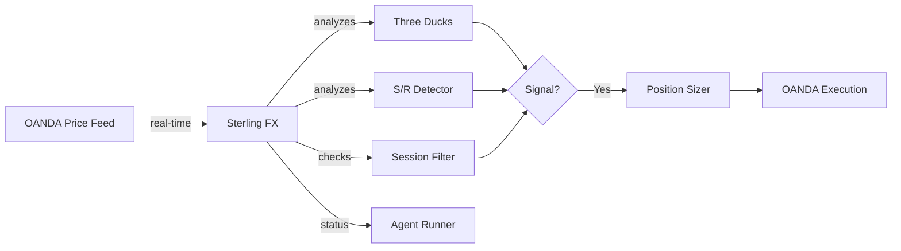

# Sterling FX - Forex Trading Agent

---
tags: #agent #forex #python
status: 🔧 Optimization In Progress
market: Forex (GBP/USD, EUR/USD, USD/JPY)
broker: OANDA
---

## Overview

**Sterling FX** is an autonomous Python agent specializing in **forex trading** with a focus on major pairs, particularly GBP/USD ("Cable").

**Current Status**: Parameter fix applied, backtest verification pending

---

## 🔧 Optimization Log (2026-03-15)

### Problem Identified
Backtest showed **0 trades** over 50 days (Jan 24 - Mar 14, 2026).

### Root Cause
`threshold_pct: 1.5` in backtest config was too high for forex.
- 1.5% on GBP/USD ≈ 150 pips
- GBP/USD typical 15m range: 30-80 pips (0.3-0.8%)
- VWAP reversion threshold was never triggered

### Fix Applied
**File**: `scripts/backtest_config.py` line 98
```python
# OLD: "threshold_pct": 1.5
# NEW: "threshold_pct": 0.4  # ~40 pips, reasonable for forex
```

### Expected Outcome
- Trades: 0 → 20-40 over 50 days
- Win Rate: Target >35%
- Return: Target positive

### Backtest Verification
Status: 🔧 Running (awaiting results)

---

## Technical Details

### Implementation
- **File**: `scripts/sterling_fx_engine.py`
- **Language**: Python
- **Data Source**: OANDA API
- **Execution**: OANDA
- **Orchestration**: Spawned by [[Agent Runner]]

### Environment Variables
```env
OANDA_API_KEY=...
OANDA_ACCOUNT_ID=...
OANDA_BASE_URL=https://api-fxpractice.oanda.com
```

---

## Traded Pairs

### Primary Focus
- **GBP/USD** (Cable) - Main pair
- **EUR/USD** (Euro) - Most liquid pair
- **USD/JPY** (Gopher) - Asian session favorite

### Secondary
- **EUR/GBP** - Cross pair
- **GBP/JPY** - High volatility cross
- **AUD/USD** - Commodity currency

---

## Trading Strategies

### 1. Three Ducks
Multi-timeframe trend alignment (see [[Three Ducks]]).

**Logic**:
- 4H SMA(60) for overall trend
- 1H SMA(60) must align
- 5M SMA(60) must align
- Enter on 5M confirmation

### 2. London Breakout
Trade the London session open volatility.

**Logic**:
- Mark Asian session high/low (00:00-08:00 GMT)
- Enter on breakout after 08:00 GMT
- Target: Asian range size
- Stop: Opposite side of range

### 3. Support/Resistance
Zone-based trading (see [[Support Resistance]]).

**Logic**:
- Identify key levels from D1/H4
- Wait for price approach + rejection
- Enter with confirmation candle
- Target: Next S/R level

---

## Forex Session Awareness

| Session | Time (GMT) | Pairs | Volatility |
|---------|------------|-------|------------|
| **Sydney** | 22:00-07:00 | AUD, NZD | Low |
| **Tokyo** | 00:00-09:00 | JPY | Low-Medium |
| **London** | 08:00-17:00 | EUR, GBP | High |
| **New York** | 13:00-22:00 | USD | High |
| **Overlap** | 13:00-17:00 | All | Highest |

**Best Trading Windows**:
- London open (08:00-10:00 GMT)
- US open (13:00-15:00 GMT)
- London/NY overlap (13:00-17:00 GMT)

---

## Data Flow



---

## Lot Sizing

Forex uses **lots** for position sizing:

| Lot Type | Units | Pip Value (USD pairs) |
|----------|-------|----------------------|
| Standard | 100,000 | $10 per pip |
| Mini | 10,000 | $1 per pip |
| Micro | 1,000 | $0.10 per pip |

### Position Size Calculation

```python
def calculate_lot_size(
    account_balance: float,
    risk_percentage: float,
    stop_loss_pips: float,
    pip_value: float = 10.0  # Standard lot
) -> float:
    risk_amount = account_balance * (risk_percentage / 100)
    lot_size = risk_amount / (stop_loss_pips * pip_value)
    return round(lot_size, 2)

# Example:
# Account: $10,000
# Risk: 1% ($100)
# Stop: 20 pips
# Lot size: $100 / (20 * $10) = 0.5 lots (50,000 units)
```

---

## Entry Criteria

### Three Ducks Entry
1. **4H: Price > SMA(60)** - Bullish bias
2. **1H: Price > SMA(60)** - Confirms 4H
3. **5M: Price crosses above SMA(60)** - Entry trigger
4. **Session: London or NY** - Active markets

### London Breakout Entry
1. **Time: After 08:00 GMT**
2. **Asian range > 30 pips** - Sufficient movement
3. **Breakout with momentum** - Strong candle close
4. **Not Friday afternoon** - Weekend risk

---

## Exit Criteria

### Take Profit
- Three Ducks: 2-3x risk (move to breakeven at 1x)
- London Breakout: Asian range size projection
- S/R: Next significant level

### Stop Loss
- Three Ducks: Below 5M swing low (long) or above swing high (short)
- London Breakout: Opposite side of Asian range
- S/R: Beyond the zone (10-15 pips)

### Time-Based
- Close all positions before weekend (Friday 17:00 GMT)
- Reduce exposure during news events

---

## Agent Status Updates

```python
print(f"AGENT_STATUS_UPDATE:{json.dumps({
    'agent_id': 'sterling-fx',
    'status': 'active',
    'market': 'Forex',
    'session': 'London',
    'current_position': {
        'pair': 'GBP/USD',
        'side': 'long',
        'entry_price': 1.2650,
        'current_price': 1.2680,
        'size_lots': 0.5,
        'unrealized_pnl': 150.00,
        'unrealized_pips': 30
    },
    'daily_pnl': 225.00,
    'gbp_usd': 1.2680,
    'eur_usd': 1.0850,
    'trend_bias': 'bullish'
})}")
```

---

## News Calendar Integration

High-impact news events affect forex significantly:

### Avoid Trading During
- NFP (Non-Farm Payrolls) - First Friday of month
- FOMC (Fed meetings) - 8 times per year
- ECB/BOE rate decisions
- CPI releases

### Implementation
```python
def is_news_blackout() -> bool:
    # Check economic calendar
    events = get_upcoming_events(hours=1)
    high_impact = [e for e in events if e['impact'] == 'high']
    return len(high_impact) > 0
```

---

## Performance Tracking

### Metrics
- **Win Rate**: Target > 50% for trend strategies
- **Average Win**: 40-60 pips
- **Average Loss**: 20-30 pips
- **Risk/Reward**: Minimum 1.5:1

### Dashboard View
Navigate to `/agents/sterling-fx`:
- Current positions with pip P&L
- Session indicator
- Trend bias per pair
- News calendar

---

## Known Issues

### Current
1. **Weekend gaps** - Can cause large losses
   - **Mitigation**: Close all positions Friday

2. **Spread widening during news** - Slippage risk
   - **Mitigation**: Avoid trading during high-impact news

### Needs Investigation
- Validate Three Ducks alignment detection
- Test London breakout during low-volatility days
- Confirm pip calculation for cross pairs

---

## Development Tasks

### Needs Review
- [ ] Validate Three Ducks strategy
- [ ] Test London breakout timing
- [ ] Verify lot size calculations
- [ ] Add session detection

### Planned
- [ ] Add news calendar integration
- [ ] Implement correlation monitoring
- [ ] Add carry trade strategy
- [ ] Backtesting integration

---

## Related Pages

- [[Agent System]] - How autonomous agents work
- [[Three Ducks]] - Multi-timeframe strategy
- [[Support Resistance]] - Zone-based trading
- [[OANDA Broker]] - Broker integration
- [[Trade Execution]] - Order execution flow
