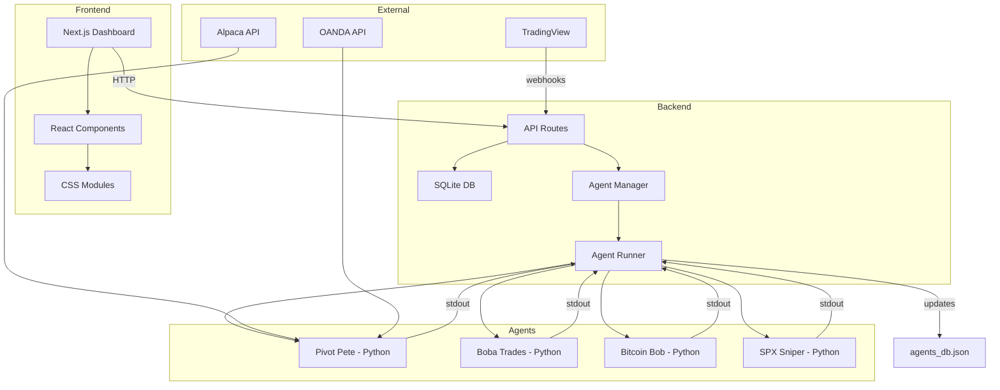
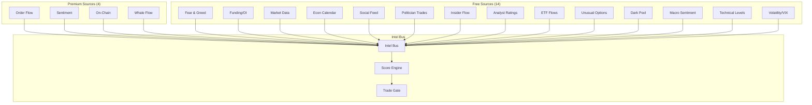

# System Architecture

---
tags: #architecture #core
status: 📘 Reference
---

## Overview

SwjshAK is a **hybrid TypeScript + Python** algorithmic trading platform with autonomous agents, real-time monitoring, and multi-market execution.

**Design Philosophy**: "Cyber-Industrial" dark mode aesthetic with glassmorphism

---

## Tech Stack

### Frontend
- **Framework**: Next.js 15 (App Router)
- **Styling**: Vanilla CSS Modules with HSL variables
- **Charts**: `lightweight-charts` (TradingView open-source)
- **State**: React Context (no Redux/Zustand)

### Backend
- **Runtime**: Node.js + TypeScript
- **Database**: SQLite with `better-sqlite3`
- **Agents**: Hybrid TS/Python processes
- **Orchestration**: PM2 (local) or supervisord (Docker)

### External Services
- **Market Data**: Alpaca, OANDA, Polygon, yfinance
- **Brokers**: OANDA (Forex), Alpaca (Stocks/Options/Crypto)
- **Signals**: TradingView webhooks

---

## System Layers



---

## Core Components

### 1. Frontend Dashboard
**Location**: `src/app/`, `src/components/`

**Key Pages**:
- `/dashboard` - Main trading interface
- `/agents` - Real-time agent monitoring
- `/agents/[id]` - Individual agent terminal
- `/journal` - Trade logging and analytics
- `/strategies` - Strategy management

**Communication**:
- Polls `/api/agents` for status updates
- WebSocket-like experience via React Context + polling

---

### 2. Agent Runner
**Location**: `scripts/agent_runner.ts`

**Responsibilities**:
- Spawns all Python agents as child processes
- Monitors agent health (restarts after 30s if crashed)
- Parses `AGENT_STATUS_UPDATE:{json}` from agent stdout
- Updates `src/app/api/agents/agents_db.json` with agent state
- Provides single entry point for system startup

**Critical**: Never run Python agents directly - causes duplicate instances

---

### 3. Python Agents
**Location**: `scripts/*_engine.py`

**Current Agents**:
- [[Pivot Pete]] (`pivot_pete_engine.py`) - Futures
- [[Boba Trades]] (`boba_trades_engine.py`) - Options
- [[Bitcoin Bob]] (`bitcoin_bob_engine.py`) - Crypto
- [[SPX Sniper]] (`spx_sniper_engine.py`) - Options
- [[Sterling FX]] (`sterling_fx_engine.py`) - Forex

**Communication Protocol**:
```python
# Agent outputs to stdout
print(f"AGENT_STATUS_UPDATE:{json.dumps({
    'agent_id': 'pivot-pete',
    'status': 'active',
    'current_position': {...},
    'daily_pnl': 250.00
})}")
```

Agent Runner parses these and updates shared state.

---

### 4. Strategy Engine
**Location**: `src/lib/engine/`

**TypeScript Core**:
- `manager.ts` - Strategy registry
- `types.ts` - BaseStrategy interface
- `executor.ts` - Trade execution
- `risk.ts` - Position sizing

**Strategies** (`src/lib/engine/strategies/`):
- [[ORB]] - Opening Range Breakout
- [[VWAP Reversion]]
- [[Support Resistance]]
- [[Bollinger Breakout]]
- [[Three Ducks]]
- [[Never Stopped Out]]

See: [[Strategies Overview]]

---

### 5. Database
**Location**: `src/lib/db.ts`

**Schema** ([[Database Schema]]):
- `trades` - Entry/exit records with PnL
- `signals` - Incoming webhook alerts
- `journal_entries` - Daily notes and mood logs
- `settings` - Key-value config store

**Auto-initialized** on first run via `initDB()`

---

### 6. Intel Layer (NEW - March 2026)
**Location**: `src/lib/intel/`

**Purpose**: Market intelligence aggregation from 18 data sources for trade gating and position sizing.

**Architecture**:


**Intel Sources** (18 total):
| Source | Type | Data |
|--------|------|------|
| ORDER_FLOW | Premium | CVD, delta, absorption |
| SENTIMENT | Premium | News sentiment scores |
| ONCHAIN_CONFLUENCE | Premium | Blockchain analytics |
| WHALE_FLOW | Premium | Large wallet tracking |
| FEAR_GREED | Free | Crypto Fear & Greed Index |
| FUNDING_OI | Free | Binance funding rates & OI |
| MARKET_DATA | Free | CoinGecko prices/volume |
| ECON_CALENDAR | Free | ForexFactory events |
| SOCIAL_FEED | Free | Twitter tracking |
| POLITICIAN_TRADES | Free | Congressional STOCK Act filings |
| INSIDER_FLOW | Free | SEC Form 4 filings |
| ANALYST_RATINGS | Free | Wall Street upgrades/downgrades |
| ETF_FLOWS | Free | BTC/ETH ETF fund flows |
| OPTIONS_UNUSUAL | Free | Unusual options activity |
| DARK_POOL | Free | Dark pool prints |
| MACRO_SENTIMENT | Free | AAII, PMI, sentiment surveys |
| TECHNICAL_LEVELS | Free | Key S/R, pivots, MAs |
| VOLATILITY | Free | VIX regime tracking |

**Key Files**:
- `intel/bus.ts` - Central message bus, dedup, TTL management
- `intel/types.ts` - IntelSignal, IntelScore, weights, TTLs
- `intel/adapter.ts` - Database persistence adapter
- `intel/regime.ts` - Market regime detection
- `intel/free/service.ts` - Zero-cost API aggregation
- `intel/politicians/service.ts` - Congressional trade tracking
- `intel/__tests__/` - Integration and pillar tests

**Trade Gating**:
```typescript
// Intel score: +1.0 = strongly bullish, -1.0 = strongly bearish
const score = await intelBus.score('BTCUSD', 'LONG');
if (score.sizeMultiplier === 0) {
    // VETO - intel strongly disagrees
}
const adjustedSize = baseSize * score.sizeMultiplier;
```

---

### 7. API Routes
**Location**: `src/app/api/`

| Endpoint | Purpose |
|----------|---------|
| `/api/webhook/tradingview` | Receive TradingView alerts |
| `/api/signals` | Manual signal submission |
| `/api/journal` | CRUD for trades/journal |
| `/api/agents` | Agent status and chat |
| `/api/control` | [[LLM Control API]] |
| `/api/killswitch` | Emergency halt |

See: [[API Reference]]

---

## Data Flow

### Signal Processing
```
1. TradingView Alert
   ↓
2. POST /api/webhook/tradingview (requires WEBHOOK_SECRET)
   ↓
3. Store in SQLite signals table
   ↓
4. Agent picks up signal
   ↓
5. Strategy evaluates (StrategyLoop.processTick())
   ↓
6. Execute via TradeExecutor
   ↓
7. Record in trades table
   ↓
8. Update agents_db.json state
   ↓
9. Frontend polls /api/agents
   ↓
10. Dashboard displays trade
```

### Agent Lifecycle
```
1. START_SWJSH.ps1 launches Agent Runner
   ↓
2. Agent Runner spawns Python processes
   ↓
3. Python agent connects to data source (Alpaca, OANDA)
   ↓
4. Agent emits AGENT_STATUS_UPDATE to stdout
   ↓
5. Agent Runner parses and updates agents_db.json
   ↓
6. Frontend reads agents_db.json via /api/agents
   ↓
7. Agent crashes? → Auto-restart after 30s
```

---

## File Structure

```
SwjshAlgoKnife/
├── src/
│   ├── app/                    # Next.js pages & API routes
│   ├── components/             # React components
│   ├── lib/
│   │   ├── engine/            # Strategy engine
│   │   ├── broker/            # Broker integrations
│   │   └── db.ts              # Database init
│   └── context/               # React contexts
├── scripts/
│   ├── agent_runner.ts        # 🔑 Master orchestrator
│   ├── *_engine.py            # Python agents
│   └── ecosystem.config.js    # PM2 config
├── data/
│   └── futures_agent_status.json  # Agent state
└── public/                    # Static assets
```

See: [[File Structure]] for detailed breakdown

---

## Environment Variables

Required for production:

```env
WEBHOOK_SECRET=your_secret_here
ACCOUNT_BALANCE=10000
RISK_PER_TRADE=1

# Alpaca
ALPACA_API_KEY=...
ALPACA_SECRET_KEY=...
ALPACA_BASE_URL=https://paper-api.alpaca.markets

# OANDA
OANDA_API_KEY=...
OANDA_ACCOUNT_ID=...
```

See: [[Environment Variables]]

---

## Deployment

### Local (Windows)
```powershell
./START_SWJSH.ps1
```
Starts Dashboard + Agent Runner via PM2

### Docker / GCP
```bash
docker compose up -d
```
Uses supervisord to manage processes

See: [[Deployment]] for full guide

---

## Related Pages

- [[Agent System]] - Deep dive on autonomous agents
- [[Risk Management]] - Kill switch & position sizing
- [[Database Schema]] - Table definitions
- [[API Reference]] - All endpoints
- [[Troubleshooting]] - Common issues
