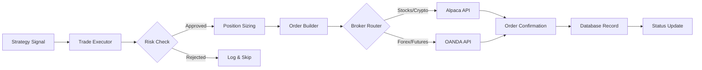

# Trade Execution

---
tags: #execution #trading #core
status: 📘 Reference
---

## Overview

Trade execution is the process of converting **signals** into **actual market orders** via broker APIs.

**Key Files**:
- `src/lib/engine/executor.ts` - Main execution interface
- `src/lib/tradeExecutor.ts` - Broker-agnostic executor
- `src/lib/broker/alpaca.ts` - Alpaca broker integration

---

## Execution Flow



---

## Signal Structure

Signals are the input to trade execution:

```typescript
interface Signal {
  symbol: string;           // 'ES', 'BTC', 'EUR/USD'
  action: 'buy' | 'sell' | 'close';
  price: number;            // Current/trigger price
  stopLoss?: number;        // Stop-loss price
  takeProfit?: number;      // Take-profit price
  size?: number;            // Override calculated size
  reason: string;           // Why signal was generated
  strategy: string;         // Source strategy name
  timestamp: string;        // ISO 8601
}
```

---

## Trade Executor

**File**: `src/lib/engine/executor.ts`

### Core Functions

```typescript
class TradeExecutor {
  /**
   * Process incoming signal and execute if valid
   */
  async execute(signal: Signal): Promise<TradeResult> {
    // 1. Validate signal
    if (!this.validateSignal(signal)) {
      return { success: false, error: 'Invalid signal' };
    }

    // 2. Check kill switch
    if (await this.isKillSwitchActive()) {
      return { success: false, error: 'Kill switch active' };
    }

    // 3. Check existing position
    const existingPosition = await this.getPosition(signal.symbol);
    if (existingPosition && signal.action !== 'close') {
      return { success: false, error: 'Position already exists' };
    }

    // 4. Calculate position size
    const size = signal.size || await this.calculatePositionSize(signal);

    // 5. Build and submit order
    const order = this.buildOrder(signal, size);
    const result = await this.submitOrder(order);

    // 6. Record trade
    if (result.success) {
      await this.recordTrade(signal, result);
    }

    return result;
  }

  /**
   * Calculate position size based on risk parameters
   */
  async calculatePositionSize(signal: Signal): Promise<number> {
    const balance = await this.getAccountBalance();
    const riskAmount = balance * (this.riskPerTrade / 100);

    if (signal.stopLoss) {
      const riskPerUnit = Math.abs(signal.price - signal.stopLoss);
      return Math.floor(riskAmount / riskPerUnit);
    }

    // Default: 1% of account / price
    return Math.floor(riskAmount / signal.price);
  }
}
```

---

## Order Types

### Market Order
Execute immediately at current market price.

```typescript
const marketOrder = {
  symbol: 'ES',
  side: 'buy',
  type: 'market',
  qty: 1,
  time_in_force: 'day'
};
```

### Limit Order
Execute only at specified price or better.

```typescript
const limitOrder = {
  symbol: 'ES',
  side: 'buy',
  type: 'limit',
  qty: 1,
  limit_price: 5850.00,
  time_in_force: 'gtc'  // Good 'til canceled
};
```

### Stop Order
Trigger when price reaches stop level.

```typescript
const stopOrder = {
  symbol: 'ES',
  side: 'sell',
  type: 'stop',
  qty: 1,
  stop_price: 5800.00,
  time_in_force: 'day'
};
```

### Bracket Order (OCO)
Entry with automatic stop-loss and take-profit.

```typescript
const bracketOrder = {
  symbol: 'ES',
  side: 'buy',
  type: 'market',
  qty: 1,
  order_class: 'bracket',
  stop_loss: { stop_price: 5800.00 },
  take_profit: { limit_price: 5900.00 }
};
```

---

## Broker Integration

### Alpaca

**File**: `src/lib/broker/alpaca.ts`

**Markets**: Stocks, Options, Crypto

```typescript
import Alpaca from '@alpacahq/alpaca-trade-api';

const alpaca = new Alpaca({
  keyId: process.env.ALPACA_API_KEY,
  secretKey: process.env.ALPACA_SECRET_KEY,
  baseUrl: process.env.ALPACA_BASE_URL,  // paper or live
  paper: true
});

// Submit order
const order = await alpaca.createOrder({
  symbol: 'SPY',
  qty: 10,
  side: 'buy',
  type: 'market',
  time_in_force: 'day'
});

// Get positions
const positions = await alpaca.getPositions();

// Close position
await alpaca.closePosition('SPY');
```

---

### OANDA

**Used By**: [[Pivot Pete]], [[Sterling FX]]

**Markets**: Forex, Futures (CFDs)

```typescript
// OANDA uses REST API with Bearer token
const headers = {
  'Authorization': `Bearer ${process.env.OANDA_API_KEY}`,
  'Content-Type': 'application/json'
};

// Submit order
const response = await fetch(
  `${OANDA_BASE_URL}/v3/accounts/${ACCOUNT_ID}/orders`,
  {
    method: 'POST',
    headers,
    body: JSON.stringify({
      order: {
        instrument: 'EUR_USD',
        units: '10000',  // Positive = buy, negative = sell
        type: 'MARKET',
        timeInForce: 'FOK'  // Fill or kill
      }
    })
  }
);
```

---

## Position Management

### Getting Open Positions

```typescript
async function getPositions(): Promise<Position[]> {
  // Alpaca
  const alpacaPositions = await alpaca.getPositions();

  // OANDA
  const oandaResponse = await fetch(
    `${OANDA_BASE_URL}/v3/accounts/${ACCOUNT_ID}/positions`,
    { headers }
  );
  const oandaPositions = await oandaResponse.json();

  return [...alpacaPositions, ...oandaPositions];
}
```

### Closing Positions

```typescript
// Close specific position
async function closePosition(symbol: string): Promise<void> {
  // Check which broker holds this position
  const position = await getPosition(symbol);

  if (position.broker === 'alpaca') {
    await alpaca.closePosition(symbol);
  } else if (position.broker === 'oanda') {
    await fetch(
      `${OANDA_BASE_URL}/v3/accounts/${ACCOUNT_ID}/positions/${symbol}/close`,
      { method: 'PUT', headers }
    );
  }
}

// Close all positions (emergency)
async function closeAllPositions(): Promise<void> {
  await alpaca.closeAllPositions();
  // OANDA requires closing each position individually
  const oandaPositions = await getOandaPositions();
  for (const pos of oandaPositions) {
    await closePosition(pos.instrument);
  }
}
```

---

## Risk Checks Before Execution

### Pre-Trade Validation

```typescript
async function validateTrade(signal: Signal): Promise<ValidationResult> {
  const checks = [];

  // 1. Kill switch
  if (await isKillSwitchActive()) {
    checks.push({ passed: false, reason: 'Kill switch is active' });
  }

  // 2. Daily loss limit
  const dailyPnL = await getDailyPnL();
  const maxDailyLoss = await getSetting('max_daily_loss');
  if (dailyPnL < -maxDailyLoss) {
    checks.push({ passed: false, reason: 'Daily loss limit reached' });
  }

  // 3. Max positions
  const openPositions = await getPositions();
  const maxPositions = await getSetting('max_positions');
  if (openPositions.length >= maxPositions) {
    checks.push({ passed: false, reason: 'Max positions reached' });
  }

  // 4. Buying power
  const account = await getAccount();
  const requiredCapital = signal.price * signal.size;
  if (account.buying_power < requiredCapital) {
    checks.push({ passed: false, reason: 'Insufficient buying power' });
  }

  // 5. Market hours
  if (!isMarketOpen(signal.symbol)) {
    checks.push({ passed: false, reason: 'Market is closed' });
  }

  return {
    valid: checks.every(c => c.passed !== false),
    checks
  };
}
```

---

## Recording Trades

After successful execution, trades are recorded in SQLite:

```typescript
async function recordTrade(signal: Signal, result: OrderResult): Promise<void> {
  const db = getDatabase();

  db.prepare(`
    INSERT INTO trades (
      symbol, side, entry_price, quantity,
      entry_time, strategy, agent_id, notes
    ) VALUES (?, ?, ?, ?, ?, ?, ?, ?)
  `).run(
    signal.symbol,
    signal.action === 'buy' ? 'long' : 'short',
    result.filled_avg_price,
    result.filled_qty,
    new Date().toISOString(),
    signal.strategy,
    signal.agent_id,
    signal.reason
  );
}
```

---

## Error Handling

### Common Execution Errors

| Error | Cause | Handling |
|-------|-------|----------|
| `Insufficient funds` | Not enough buying power | Reduce position size or wait |
| `Market is closed` | Outside trading hours | Queue for market open |
| `Symbol not found` | Invalid ticker | Validate symbol before execution |
| `Order rejected` | Broker rejected order | Log and notify, retry with modifications |
| `Connection timeout` | Network/API issue | Retry with exponential backoff |

### Retry Logic

```typescript
async function executeWithRetry(
  signal: Signal,
  maxRetries: number = 3
): Promise<TradeResult> {
  for (let attempt = 1; attempt <= maxRetries; attempt++) {
    try {
      return await execute(signal);
    } catch (error) {
      if (attempt === maxRetries) throw error;

      // Exponential backoff: 1s, 2s, 4s
      await sleep(1000 * Math.pow(2, attempt - 1));
    }
  }
}
```

---

## Execution Modes

### Live Trading
Real money, real consequences.

```env
ALPACA_BASE_URL=https://api.alpaca.markets
OANDA_BASE_URL=https://api-fxtrade.oanda.com
```

### Paper Trading
Simulated execution with real market data.

```env
ALPACA_BASE_URL=https://paper-api.alpaca.markets
OANDA_BASE_URL=https://api-fxpractice.oanda.com
```

### Backtest Mode
Historical simulation, no broker connection.

```typescript
class BacktestExecutor extends TradeExecutor {
  async submitOrder(order: Order): Promise<OrderResult> {
    // Simulate fill at signal price
    return {
      success: true,
      filled_qty: order.qty,
      filled_avg_price: order.price,
      simulated: true
    };
  }
}
```

See: [[Universal Backtest]]

---

## Agent-Specific Execution

Each agent uses the executor differently:

### Pivot Pete (Futures)
- Uses OANDA for execution
- Bracket orders with ORB-based stops
- Session-based position management

### Boba Trades (Options)
- Uses Alpaca for execution
- Spread orders (multi-leg)
- Greek-based position sizing

### Bitcoin Bob (Crypto)
- Uses Alpaca for execution
- 24/7 execution capability
- Volatility-adjusted sizing

---

## Monitoring & Debugging

### Execution Logs

```typescript
function logExecution(signal: Signal, result: TradeResult): void {
  console.log(`[EXECUTION] ${new Date().toISOString()}`);
  console.log(`  Signal: ${signal.action} ${signal.symbol} @ ${signal.price}`);
  console.log(`  Result: ${result.success ? 'SUCCESS' : 'FAILED'}`);
  if (result.success) {
    console.log(`  Filled: ${result.filled_qty} @ ${result.filled_avg_price}`);
  } else {
    console.log(`  Error: ${result.error}`);
  }
}
```

### Dashboard View

Navigate to `/dashboard` → Active Signals panel to see:
- Pending signals awaiting execution
- Recent executions with fill details
- Failed executions with error reasons

---

## Related Pages

- [[Risk Management]] - Position sizing and limits
- [[Signal Processing]] - How signals are generated
- [[Agent System]] - How agents trigger execution
- [[Database Schema]] - Trade recording
- [[Troubleshooting]] - Execution error fixes
- [[Alpaca Data]] - Alpaca broker details
- [[OANDA Broker]] - OANDA integration
