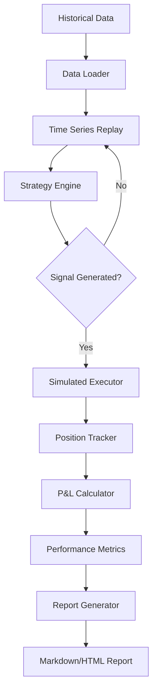

# Universal Backtest

---
tags: #backtesting #testing #development
status: 🔧 In Progress
---

## Overview

The **Universal Backtest Harness** is a Python-based framework for testing trading strategies against historical data before deploying to live markets.

**File**: `scripts/universal_backtest.py`

**Status**: Currently under development as part of [[Current Sprint]]

---

## Purpose

- **Validate strategy logic** before risking real capital
- **Measure historical performance** (win rate, drawdown, Sharpe ratio)
- **Optimize parameters** (entry thresholds, stop-loss distances)
- **Compare strategies** across different market conditions
- **Build confidence** in agent behavior

---

## Architecture



---

## Usage

### Basic Backtest

```bash
python scripts/universal_backtest.py \
  --strategy ORB \
  --symbol ES \
  --start 2025-01-01 \
  --end 2026-03-01 \
  --initial-capital 10000
```

### With Parameters

```bash
python scripts/universal_backtest.py \
  --strategy ORB \
  --symbol ES \
  --start 2025-01-01 \
  --end 2026-03-01 \
  --initial-capital 10000 \
  --risk-per-trade 1.0 \
  --opening-range-minutes 15 \
  --stop-loss-multiplier 1.5
```

### Multiple Symbols

```bash
python scripts/universal_backtest.py \
  --strategy ORB \
  --symbols ES,NQ,YM \
  --start 2025-01-01 \
  --end 2026-03-01
```

---

## Data Sources

### Alpaca Historical Data

```python
from alpaca.data.historical import StockHistoricalDataClient
from alpaca.data.requests import StockBarsRequest
from alpaca.data.timeframe import TimeFrame

client = StockHistoricalDataClient(
    api_key=os.environ['ALPACA_API_KEY'],
    secret_key=os.environ['ALPACA_SECRET_KEY']
)

request = StockBarsRequest(
    symbol_or_symbols=['ES'],
    timeframe=TimeFrame.Minute,
    start=datetime(2025, 1, 1),
    end=datetime(2026, 3, 1)
)

bars = client.get_stock_bars(request)
```

### Yahoo Finance (Fallback)

```python
import yfinance as yf

# Fetch historical data
data = yf.download(
    'ES=F',  # E-mini S&P 500 futures
    start='2025-01-01',
    end='2026-03-01',
    interval='1m'  # 1-minute bars
)
```

### Local CSV Files

```python
import pandas as pd

# Load from exported data
data = pd.read_csv('data/historical/ES_1m.csv', parse_dates=['timestamp'])
data.set_index('timestamp', inplace=True)
```

---

## Core Components

### 1. Data Loader

```python
class DataLoader:
    def __init__(self, source='alpaca'):
        self.source = source

    def load(self, symbol: str, start: str, end: str, timeframe: str = '1m') -> pd.DataFrame:
        """Load historical OHLCV data"""
        if self.source == 'alpaca':
            return self._load_alpaca(symbol, start, end, timeframe)
        elif self.source == 'yfinance':
            return self._load_yfinance(symbol, start, end, timeframe)
        elif self.source == 'csv':
            return self._load_csv(symbol, timeframe)
        else:
            raise ValueError(f"Unknown source: {self.source}")

    def _load_alpaca(self, symbol, start, end, timeframe):
        # Alpaca API implementation
        pass

    def _load_yfinance(self, symbol, start, end, timeframe):
        # yfinance implementation
        pass
```

---

### 2. Time Series Replay

```python
class TimeSeriesReplay:
    def __init__(self, data: pd.DataFrame):
        self.data = data
        self.current_index = 0

    def __iter__(self):
        return self

    def __next__(self) -> dict:
        if self.current_index >= len(self.data):
            raise StopIteration

        row = self.data.iloc[self.current_index]
        self.current_index += 1

        return {
            'timestamp': row.name,
            'open': row['open'],
            'high': row['high'],
            'low': row['low'],
            'close': row['close'],
            'volume': row['volume']
        }

    def get_history(self, lookback: int) -> pd.DataFrame:
        """Get historical bars for indicator calculation"""
        start = max(0, self.current_index - lookback)
        return self.data.iloc[start:self.current_index]
```

---

### 3. Strategy Interface

```python
from abc import ABC, abstractmethod

class BacktestStrategy(ABC):
    def __init__(self, params: dict = None):
        self.params = params or {}
        self.position = None

    @abstractmethod
    def on_bar(self, bar: dict, history: pd.DataFrame) -> dict | None:
        """
        Process a bar and return signal if any.

        Returns:
            None if no signal
            {'action': 'buy'|'sell'|'close', 'price': float, 'reason': str}
        """
        pass

    def set_position(self, position: dict):
        self.position = position

    def get_position(self) -> dict | None:
        return self.position
```

---

### 4. Simulated Executor

```python
class SimulatedExecutor:
    def __init__(self, initial_capital: float, commission: float = 0.0):
        self.capital = initial_capital
        self.commission = commission
        self.positions = []
        self.trades = []

    def execute(self, signal: dict, bar: dict) -> dict:
        """Simulate order execution"""
        if signal['action'] == 'buy':
            return self._open_long(signal, bar)
        elif signal['action'] == 'sell':
            return self._open_short(signal, bar)
        elif signal['action'] == 'close':
            return self._close_position(bar)

    def _open_long(self, signal, bar):
        size = self._calculate_size(signal, bar)
        cost = size * bar['close'] + self.commission

        if cost > self.capital:
            return {'success': False, 'error': 'Insufficient capital'}

        self.capital -= cost
        position = {
            'side': 'long',
            'entry_price': bar['close'],
            'size': size,
            'entry_time': bar['timestamp'],
            'stop_loss': signal.get('stop_loss'),
            'take_profit': signal.get('take_profit')
        }
        self.positions.append(position)

        return {'success': True, 'position': position}

    def _close_position(self, bar):
        if not self.positions:
            return {'success': False, 'error': 'No position to close'}

        position = self.positions.pop()
        pnl = self._calculate_pnl(position, bar['close'])
        self.capital += (position['size'] * bar['close']) - self.commission

        trade = {
            **position,
            'exit_price': bar['close'],
            'exit_time': bar['timestamp'],
            'pnl': pnl
        }
        self.trades.append(trade)

        return {'success': True, 'trade': trade}
```

---

### 5. Performance Calculator

```python
class PerformanceCalculator:
    def __init__(self, trades: list, initial_capital: float):
        self.trades = trades
        self.initial_capital = initial_capital

    def calculate(self) -> dict:
        if not self.trades:
            return {'error': 'No trades to analyze'}

        pnls = [t['pnl'] for t in self.trades]
        winning = [p for p in pnls if p > 0]
        losing = [p for p in pnls if p < 0]

        return {
            'total_trades': len(self.trades),
            'winning_trades': len(winning),
            'losing_trades': len(losing),
            'win_rate': len(winning) / len(self.trades) if self.trades else 0,
            'total_pnl': sum(pnls),
            'average_win': sum(winning) / len(winning) if winning else 0,
            'average_loss': sum(losing) / len(losing) if losing else 0,
            'profit_factor': abs(sum(winning) / sum(losing)) if losing else float('inf'),
            'max_drawdown': self._calculate_max_drawdown(),
            'sharpe_ratio': self._calculate_sharpe_ratio(),
            'return_pct': (sum(pnls) / self.initial_capital) * 100
        }

    def _calculate_max_drawdown(self) -> float:
        """Calculate maximum peak-to-trough drawdown"""
        equity = [self.initial_capital]
        for trade in self.trades:
            equity.append(equity[-1] + trade['pnl'])

        peak = equity[0]
        max_dd = 0

        for value in equity:
            if value > peak:
                peak = value
            dd = (peak - value) / peak
            if dd > max_dd:
                max_dd = dd

        return max_dd * 100  # As percentage

    def _calculate_sharpe_ratio(self, risk_free_rate: float = 0.02) -> float:
        """Calculate annualized Sharpe ratio"""
        if len(self.trades) < 2:
            return 0

        returns = [t['pnl'] / self.initial_capital for t in self.trades]
        avg_return = sum(returns) / len(returns)
        std_return = (sum((r - avg_return) ** 2 for r in returns) / len(returns)) ** 0.5

        if std_return == 0:
            return 0

        # Annualize (assuming ~252 trading days)
        annual_return = avg_return * 252
        annual_std = std_return * (252 ** 0.5)

        return (annual_return - risk_free_rate) / annual_std
```

---

## Report Generation

### Markdown Report

```python
def generate_report(metrics: dict, trades: list, strategy: str, symbol: str) -> str:
    report = f"""# Backtest Report: {strategy} on {symbol}

## Performance Summary

| Metric | Value |
|--------|-------|
| Total Trades | {metrics['total_trades']} |
| Win Rate | {metrics['win_rate']:.1%} |
| Total P&L | ${metrics['total_pnl']:.2f} |
| Return | {metrics['return_pct']:.2f}% |
| Profit Factor | {metrics['profit_factor']:.2f} |
| Max Drawdown | {metrics['max_drawdown']:.2f}% |
| Sharpe Ratio | {metrics['sharpe_ratio']:.2f} |

## Trade Details

| # | Entry | Exit | Side | P&L |
|---|-------|------|------|-----|
"""

    for i, trade in enumerate(trades, 1):
        report += f"| {i} | {trade['entry_time']} | {trade['exit_time']} | {trade['side']} | ${trade['pnl']:.2f} |\n"

    return report
```

### HTML Report (with Charts)

```python
def generate_html_report(metrics: dict, trades: list, equity_curve: list) -> str:
    # Uses matplotlib or plotly for equity curve visualization
    # Generates standalone HTML with embedded charts
    pass
```

---

## Strategy Examples

### ORB Backtest Implementation

```python
class ORBBacktest(BacktestStrategy):
    def __init__(self, params=None):
        super().__init__(params)
        self.opening_range_minutes = params.get('opening_range_minutes', 15)
        self.opening_range = None
        self.session_start = None

    def on_bar(self, bar: dict, history: pd.DataFrame) -> dict | None:
        # Check if new session
        if self._is_session_start(bar['timestamp']):
            self.session_start = bar['timestamp']
            self.opening_range = None

        # Build opening range
        if self._in_opening_range(bar['timestamp']):
            self._update_opening_range(bar)
            return None

        # Check for breakout
        if self.opening_range and not self.position:
            if bar['close'] > self.opening_range['high']:
                return {
                    'action': 'buy',
                    'price': bar['close'],
                    'stop_loss': self.opening_range['low'],
                    'take_profit': bar['close'] + 2 * (self.opening_range['high'] - self.opening_range['low']),
                    'reason': 'ORB breakout above range'
                }
            elif bar['close'] < self.opening_range['low']:
                return {
                    'action': 'sell',
                    'price': bar['close'],
                    'stop_loss': self.opening_range['high'],
                    'reason': 'ORB breakdown below range'
                }

        # Check stop-loss / take-profit
        if self.position:
            return self._check_exit(bar)

        return None
```

---

## Integration with Agents

### Testing Agent Logic

```python
# Test Pivot Pete's ORB strategy
python scripts/universal_backtest.py \
  --strategy pivot_pete_orb \
  --symbol ES \
  --start 2025-06-01 \
  --end 2026-03-01 \
  --params '{"opening_range_minutes": 15, "stop_multiplier": 1.5}'
```

### Comparing Agent Performance

```python
# Run backtest for all agents
for agent in ['pivot_pete', 'boba_trades', 'bitcoin_bob']:
    results = backtest(
        strategy=agent,
        symbol=AGENT_SYMBOLS[agent],
        start='2025-01-01',
        end='2026-03-01'
    )
    print(f"{agent}: {results['return_pct']:.2f}% return, {results['win_rate']:.1%} win rate")
```

---

## Known Limitations

1. **No slippage modeling** - Fills at exact signal price (optimistic)
2. **No spread/commission** - Can add via `--commission` flag
3. **No partial fills** - All-or-nothing execution
4. **Single position** - Doesn't support pyramiding (yet)
5. **Daily data gaps** - Weekends/holidays may need handling

---

## Roadmap

- [x] Basic replay engine
- [x] ORB strategy implementation
- [ ] VWAP Reversion backtest
- [ ] Multi-strategy comparison
- [ ] Parameter optimization (grid search)
- [ ] Monte Carlo simulation
- [ ] Walk-forward analysis
- [ ] Integration with dashboard (visualize in UI)

---

## Related Pages

- [[Strategies Overview]] - Strategy descriptions
- [[Pivot Pete]] - Futures agent using ORB
- [[Current Sprint]] - Backtest harness development status
- [[Trade Execution]] - Live execution comparison
- [[Risk Management]] - Position sizing in backtests
