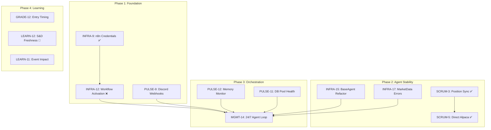

# Cross-Project Dependency Map for Go-Live

> Created by: Agent Chief (MGMT-12)
> Date: 2026-03-22
> Status: Active - Updated each sprint

---

## Critical Path to Full Autonomous Operation

```
┌────────────────────────────────────────────────────────────────────────────┐
│                    CRITICAL PATH TO AUTONOMY                               │
│                                                                            │
│  Phase 1: FOUNDATION (Current)                                             │
│  ├── INFRA-9 (n8n credentials) ✅ DONE                                     │
│  ├── INFRA-12 (workflow activation) ❌ BLOCKED - credential type mismatch │
│  └── PULSE-9 (Discord webhooks) → Status TBD                              │
│                                                                            │
│  Phase 2: AGENT STABILITY                                                  │
│  ├── SCRUM-3 (position sync) ✅ DONE                                       │
│  ├── SCRUM-5 (direct Alpaca for SPX) ✅ DONE                               │
│  ├── INFRA-15 (BaseAgent refactor) ⏳ TO DO                                │
│  └── INFRA-17 (MarketData error handling) ⏳ TO DO                         │
│                                                                            │
│  Phase 3: ORCHESTRATION                                                    │
│  ├── MGMT-14 (24/7 agent loop) ⏳ BLOCKED on Phase 1                       │
│  ├── PULSE-12 (memory monitoring) ⏳ TO DO                                 │
│  └── PULSE-11 (DB pool health) ⏳ TO DO                                    │
│                                                                            │
│  Phase 4: LEARNING & GRADING                                               │
│  ├── GRADE-12 (entry timing score) ⏳ TO DO                                │
│  ├── LEARN-12 (S&D freshness decay) 🔄 IN PROGRESS                        │
│  └── LEARN-11 (economic event impact) ⏳ TO DO                             │
│                                                                            │
│  Phase 5: RESEARCH & EXPANSION                                             │
│  ├── BACK-14 (Interactive Brokers) ⏳ TO DO                                │
│  └── BACK-12 (Treasury yield strategy) ⏳ TO DO                            │
└────────────────────────────────────────────────────────────────────────────┘
```

---

## Project-by-Project Status

### MGMT (Management Hub) - Chief's Domain

| Ticket | Summary | Status | Priority | Dependencies | Blocks |
|--------|---------|--------|----------|--------------|--------|
| MGMT-14 | 24/7 agent loop infrastructure | Backlog | Highest | INFRA-9 ✅, PULSE-9 | Everything |
| MGMT-12 | Cross-project dependency map | In Progress | High | None | Sprint planning |
| MGMT-13 | Sprint velocity tracking | Backlog | Medium | None | - |
| MGMT-17 | Document dependency graph | Backlog | High | MGMT-12 | - |

### SCRUM (Main Development)

| Ticket | Summary | Status | Priority | Dependencies | Blocks |
|--------|---------|--------|----------|--------------|--------|
| SCRUM-10 | Agent Setup Wizard API | To Do | High | None | User onboarding |
| SCRUM-6 | IBroker interface | To Do | Medium | None | Broker abstraction |
| SCRUM-4 | Pre-trade health check | To Do | Medium | None | Trade safety |

### INFRA (Infrastructure)

| Ticket | Summary | Status | Priority | Dependencies | Blocks |
|--------|---------|--------|----------|--------------|--------|
| INFRA-17 | Fix MarketData.ts silent errors | To Do | High | None | Agent reliability |
| INFRA-15 | BaseAgent refactor | To Do | High | None | Code quality |
| INFRA-9 | n8n Jira credentials | Done | Highest | None | MGMT-14 (partial) |
| INFRA-8 | jira_client.py backoff | To Do | Medium | None | API reliability |

### PULSE (System Health)

| Ticket | Summary | Status | Priority | Dependencies | Blocks |
|--------|---------|--------|----------|--------------|--------|
| PULSE-12 | Python agent memory usage | To Do | High | None | Stability |
| PULSE-11 | DB connection pool health | To Do | High | None | Data integrity |
| PULSE-8 | Jira connectivity dashboard | To Do | Medium | None | Visibility |

### GRADE (Trade Grading)

| Ticket | Summary | Status | Priority | Dependencies | Blocks |
|--------|---------|--------|----------|--------------|--------|
| GRADE-12 | Entry timing quality score | To Do | High | None | Grade accuracy |
| GRADE-14 | Hold duration analysis | Backlog | High | None | Exit grading |
| GRADE-13 | Position sizing discipline | Backlog | High | None | Risk scoring |

### LEARN (Research & Learning)

| Ticket | Summary | Status | Priority | Dependencies | Blocks |
|--------|---------|--------|----------|--------------|--------|
| LEARN-12 | S&D zone freshness decay | In Progress | High | None | Zone validity |
| LEARN-11 | Economic event impact | To Do | High | None | News trading |
| LEARN-13 | ORB width threshold | Backlog | High | None | ORB strategy |

### BACK (Backlog & Research)

| Ticket | Summary | Status | Priority | Dependencies | Blocks |
|--------|---------|--------|----------|--------------|--------|
| BACK-14 | Interactive Brokers research | To Do | High | None | Broker expansion |
| BACK-12 | Treasury yield strategy | To Do | High | None | New strategy |
| BACK-16 | Paper trading dashboard | Backlog | High | None | Visibility |

---

## Dependency Graph (Mermaid)



---

## Blockers Summary

### Critical Blockers (Blocking Go-Live)

| Blocker | Blocked By | Impact | Resolution |
|---------|------------|--------|------------|
| INFRA-12 | Credential type mismatch (discordBotApi vs discordWebhookApi) | 18 n8n workflows cannot activate | Update workflows to use webhook credentials |
| MGMT-14 | INFRA-12, PULSE-9 | No 24/7 autonomous operation | Clear Phase 1 first |

### Medium Blockers (Blocking Quality)

| Blocker | Blocked By | Impact | Resolution |
|---------|------------|--------|------------|
| INFRA-17 | None | Silent MarketData failures | Fix error propagation |
| PULSE-12 | None | Potential memory leaks in Python agents | Add monitoring |

---

## Sprint Recommendation

### This Week's Focus (Priority Order)

1. **Fix INFRA-12** - Unblock n8n workflow activation (Hunter/Ops)
2. **Complete LEARN-12** - S&D freshness research (Scout)
3. **Start INFRA-17** - MarketData error handling (Hunter)
4. **Start PULSE-12** - Memory monitoring (Ops)

### Next Week Candidates

1. MGMT-14 - 24/7 agent loop (once Phase 1 clear)
2. INFRA-15 - BaseAgent refactor
3. GRADE-12 - Entry timing score
4. BACK-14 - Interactive Brokers research

---

## Agent Assignments

| Agent | Current Focus | Jira Project | This Week |
|-------|--------------|--------------|-----------|
| **Chief** | Coordination | MGMT | MGMT-12 (this), sprint planning |
| **Hunter** | Implementation | INFRA, SCRUM | INFRA-12, INFRA-17 |
| **Ops** | Reliability | PULSE | PULSE-12, PULSE-11 |
| **Scout** | Research | LEARN, BACK | LEARN-12 (active), BACK-14 |
| **Cortana** | Code Review | GRADE | GRADE-12 prep |
| **Arbiter** | Quality Gate | GRADE | Review queue |

---

## Update Log

| Date | Update | By |
|------|--------|-----|
| 2026-03-22 | Initial dependency map created | Chief |

---

## References

- [AUTONOMOUS-LOOP.md](./AUTONOMOUS-LOOP.md) - Full loop architecture
- [ECC_AUDIT_PLAN.md](../ECC_AUDIT_PLAN.md) - Quality audit schedule
- Agent Souls: `Library/agent-souls/*.md`
